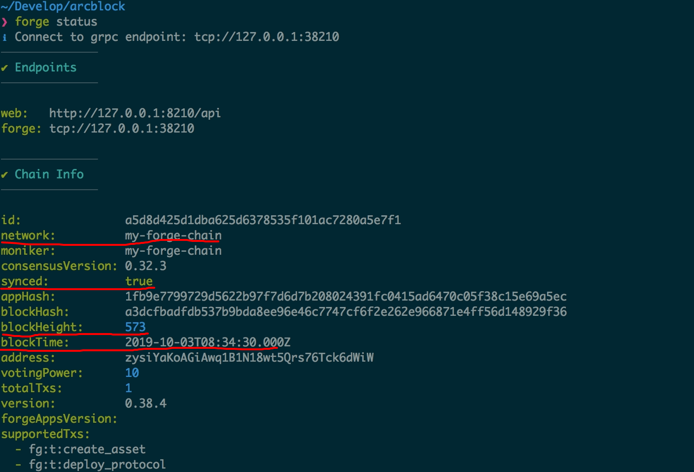

> Gavin Wood, a senior blockchain developer, can send a chain in 30 minutes. Even Fortech CLI can shorten this time by 50%. Of course, you need a reliable network environment, hehe!

## Install Forge

We have installed the Forge CLI, but we have not installed other components of Forge into the computer. Continue to execute these commands to install these components:

::: warning
If you installed the Forge CLI as root, you need to first create a non-root account, switch to that account, and then execute subsequent commands. [Install Forge CLI](../install-forge-cli)。
:::

```bash
forge install latest
```

::: success
For users in mainland China, you can use Alibaba Cloud's image to speed up the installation: `forge install --mirror https://releases.arcblockio.cn`
:::

::: success
If you want to know more details about the Forge release, you can smash: [Forge version management](../../4-manage-forge-release)。
:::

The Forge installation process is as follows:

!TerminalPlayer[](./images/1-install-release.yml)

## Issuing Chains and Coins

With everything in place, let's go straight to the bullshit: create and start a chain with the Forge CLI!

Execute the following two commands in order:

```bash
# 使用默认配置来创建一条链，然后使用
forge chain:create my-forge-chain -d

# 启动刚刚创建的链
forge start my-forge-chain
```

The whole process is illustrated below:

!TerminalPlayer[](./images/2-create-and-start-chain.yml)

Then, execute `forge web open`Not surprisingly, your local browser will open the block browser of this chain just started. The block browser can see the basic information of the chain and nodes:

- The geographic location of the node is shown in the upper left corner: `Beijing China`
- Node name, working status of each core component of the node
- The name of the chain, the symbol of the coin, the total supply, etc.
- The block height of the chain, the number of transactions, the number of accounts, and the number of validator nodes are displayed on the dashboard
- If you refresh this page, you will see that the block height keeps increasing, because even if there is no transaction, forge will still produce empty blocks.


::: warning
If you are a remote machine on a cloud platform, `forge web open` There is a high probability that it will not work. If you want to access the block browser that has just started the chain through the network, you need this machine to have a public IP and open port 8210. For more about Forge WEB, see [Here](../../8-explorer-other-tooling/forge-web)
:::

## Check the status of the chain

At this point, our single-node chain has been started. How can we confirm that the state of this chain is normal? carried out `forge status` You can see what the current chain height is:



## Check the status of coins

If you want to view the configuration of on-chain coins, you can execute `forge status core`Find in the output `token` Information, as shown below:


::: success
For more details about the running status of the chain, see: [Check the status of the chain](../../2-manage-chain-node/inspect-chain-status)。
:::

## How do I customize the configuration?

carried out `forge chain:create my-forge-chain -d` The created chain actually uses the default configuration items. What if you want to customize the configuration?

::: warning
carried out `forge chain:config set` You can open [Interactive chain node configuration process](../../2-manage-chain-node/create-config-chain), You can configure the block time, coin information, etc., but it should be noted that `forge chain:config set` It must be completed before starting the chain. Some configurations cannot be modified directly through the configuration file after the chain is started. Forge's complete configuration documentation is available at [Here](/docs/instruction/configuration)。
:::
