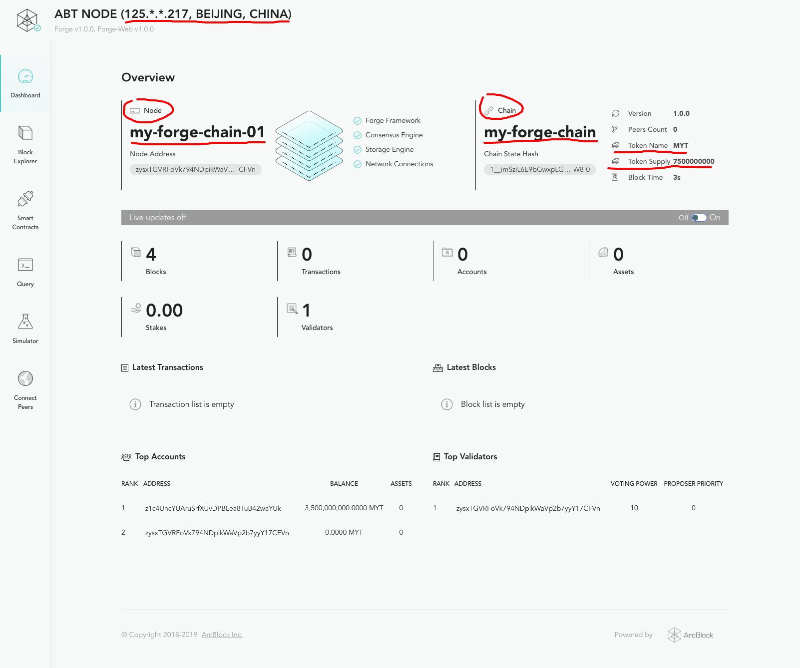

> 资深区块链开发者 Gavin Wood 能在 30 分钟内发一条链，用 Forge CLI 即使是技术小白也能把这个时间缩短 50%，当然需要你有个靠谱的网络环境，嘿嘿！

## 安装 Forge

我们已经安装好 Forge CLI，但是我们还没有把 Forge 的其他组件安装到电脑里面，继续执行如下命令来安装这些组件：

::: warning
如果你是用 root 身份安装的 Forge CLI，需要先创建非 root 账户，并且切换到该账户，再执行后续命令，参照 [安装 Forge CLI](../install-forge-cli)。
:::

```bash
forge install latest
```

::: tip
对于中国大陆的用户，可以使用阿里云的镜像来加速安装：`forge install --mirror https://releases.arcblockio.cn`
:::

::: tip
如果想了解 Forge 发行版本的更多细节可以猛击：[Forge 版本管理](../../4-manage-forge-release)。
:::

Forge 安装过程如下所示：

!TerminalPlayer[](./images/1-install-release.yml)

## 发链和发币

万事俱备，接下来我们就直接实现开头吹下的牛逼：使用 Forge CLI 创建并启动一条链！

依次执行如下两条命令：

```bash
# 使用默认配置来创建一条链，然后使用
forge chain:create my-forge-chain -d

# 启动刚刚创建的链
forge start my-forge-chain
```

整个过程如下图示：

!TerminalPlayer[](./images/2-create-and-start-chain.yml)

然后，执行 `forge web open`，不出意外，你本地的浏览器会打开刚刚启动的这条链的区块浏览器，区块浏览器里面能看到链的基本信息：

- 链的名称显示在左上角：my-forge-chain
- 链的块高、交易数量、账户数量、验证人节点数量显示在仪表盘上
- 如果你刷新这个页面，会看到块高在不停的变大，是因为即使没有交易的时候 forge 也在出空块



::: warning
如果你是在云平台上的远端机器，`forge web open` 大概率无法工作，如果你想通过网络访问刚刚启动链的区块浏览器，需要这个机器有公网的 IP，并且打开 8210 端口。关于 Forge WEB 的更多介绍参见 [这里](../../8-explorer-other-tooling/forge-web)
:::

## 检查链的状态

到这里，我们的单节点的链已经启动了，怎么确定这个链的状态是正常的呢？执行 `forge status` 即可看到当前的链块高是多少：


## 检查币的状态

如果想查看链上币的配置，可以执行 `forge status core`，在输出结果中查找 `token` 信息，如下图：


::: success
关于链运行状态查看的更多细节参见: [检查链的状态](../../2-manage-chain-node/inspect-chain-status)。
:::

## 如何自定义配置？

TODO: 如何自定义节点的配置项
