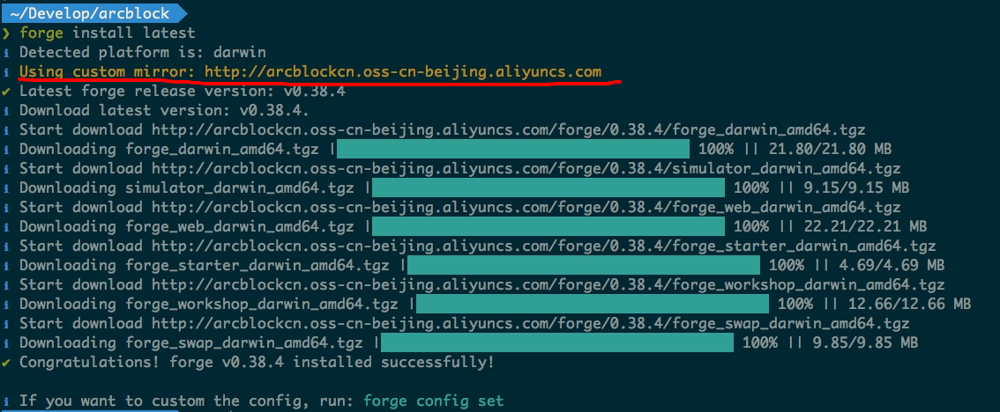

## 全局配置项

细心的你可能会纳闷：安装 Forge CLI 时指定的淘宝 npm 镜像，还有安装 Forge Release 时指定的阿里云镜像难道每次都需要手动指定？有没有办法配置一次，后面每次都用？

答案是肯定的，和广泛使用的命令行工具类似，Forge CLI 也支持几个全局的配置项。

全局配置项的存储位置在 `~/.forgerc.yml`，你需要先创建该文件：

```bash
touch ~/.forgerc.yml
```

然后在其中输出如下内容：

```yaml
registry: https://registry.npm.taobao.org
mirror: http://arcblockcn.oss-cn-beijing.aliyuncs.com
```

这样，后续执行 Forge CLI 命令都会读取和使用这些配置，比如当你再次去安装某个版本的 Forge Release 时，如下图的黄色标识就表示使用了自定义的配置：



除了 `registry` 和 `mirror` 两个配置项之外，Forge CLI 还支持更多其他的配置项，可参考[这里](../../9-customization)。

## 配置链管理员

对于区块链来说，所使用软件的版本其实相当于安装在电脑硬件上的操作系统，如果要升级操作系统的版本，我们要输入管理员密码、把操作系统停下来、重新启动完成升级，如果你经历过操作系统的升级，Forge 链的升级就很好理解。

首先，我们需要给链配置 1 个管理员（moderator，本意是协调员，因为区块链本身需要在多节点，在多节点间达成共识需要协调员），而任何能够修改链状态的实体本质都是一个钱包，即公私钥对，对于没有配置过链管理员的同学，需要先用 `forge wallet:create --defaults` 来生成一个管理员钱包，并且保存好钱包私钥。


为了后续方便，我们先把链管理员私钥配置到环境变量里面，把下面这行加到你的 `~/.bashrc` 或者 `~/.zshrc` 里面（记得把私钥换成你生成的那个）：

```shell
export FORGE_MODERATOR_SK="qDWzV5cv8wSa-I2CKiLHm3msM9GeYyjOo4yo3iNicT8xlZqcdY_o0REVnffjD_wq85sCjoka6B7D-BLPxcXUcA"
```

> 如何确保你正确把管理员私钥导出到了环境变量里面？直接执行 `echo $FORGE_MODERATOR_SK`，如果有结果输出并且和你生成的私钥相同，说明配置正确。

接下来我们需要把链管理员信息添加到 Forge 的配置里面：

- 如果你使用的是 Forge CLI v0.36.0 以下的版本，并且按本文操作时没有升级到最新版，你的配置文件在：`~/.forge_release/forge_release.toml`
- 如果你使用的是 Forge CLI v0.36.0 及以上版本，你的配置文件在：`~/.forge_chains/forge_default/forge_release.toml`

当然，我们有更简单的方式，直接获取 Forge 链配置文件的路径：`forge config | grep file`


需要把什么内容添加到 Forge 的配置文件里呢？我们不妨直接运行 `forge upgrade` 试试：


可以看到，Forge CLI 提示我们配置文件里面没有管理员相关的配置，并且提示我们要把什么内容添加进去：

```toml
[forge.moderator]
address = "z1ScT4nkbA8b6cQBKQoyWTnnQnXAsmPsdhk"
publicKey = "MZWanHWP6NERFZ334w_8KvObAo6JGugew_gSz8XF1HA"
```

打开 Forge CLI 给出的配置文件路径，把上面的配置追加到文件的末尾，保存后退出。
