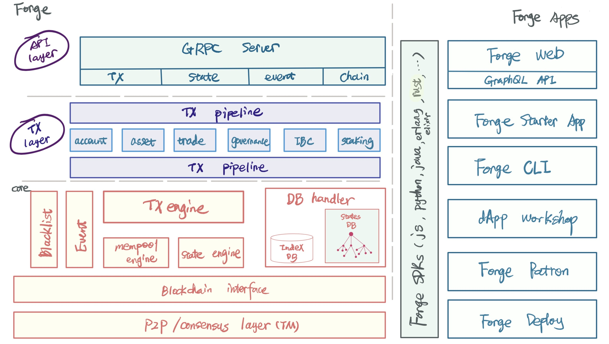

It can be said without exaggeration,**Forge CLI is a Swiss Army Knife for blockchain application development, empowering developers with the process of delivering blockchain applications in an end-to-end manner**, Including these out-of-the-box features:

- Manage your chain nodes: including development environment, production environment
- Read and write data on the chain: blocks, transactions, accounts, contracts, assets, etc.
- Manipulating wallets and accounts (Wallet and Account)
- Compile, deploy and manage smart contracts
- Rapid development using Blocklet
- Use block explorer, simulator and dApps Workshop

These functions will help in the process of developing, deploying, and running blockchain applications, such as creating chain nodes for testing, deploying to multi-node chains available in production environments, using cornerstone programs for rapid development, and so on.

## What is Forge often said?

What are we talking about when discussing Forge? Depending on the context in which it is being talked about, Forge may refer to something slightly different.

- That is, the Forge framework itself can be narrowly defined, and the basic architecture, transaction processing flow, and extension methods of the chain node are defined, encapsulated, and implemented.
- It can also be broadly referred to as a tool set composed of various blockchain tools developed around the Forge framework.

The multiple meanings of Forge are clearly shown in the following line:

- On the left is the Forge framework itself. Sometimes we also call it the Forge kernel, or the Forge core.
- On the right is a tool built on the Forge framework and can simplify developers' difficulty and automate repetitive tasks.

Forge CLI is one of the many Forge tools, and it is also the entrance for developers to use Forge and its surrounding tools. It is not an exaggeration to compare him to the Swiss Army Knife for blockchain development, because after installing Forge CLI, it can be easily obtained and used. The entire Forge toolbox.

::: success
**Contains a specific version of the Forge kernel and a collection of components to form a Forge release. When we say "install Forge", we mean installing a Forge release. For more details about the Forge release, please [Bang here](../../4-manage-forge-release)。**
:::
