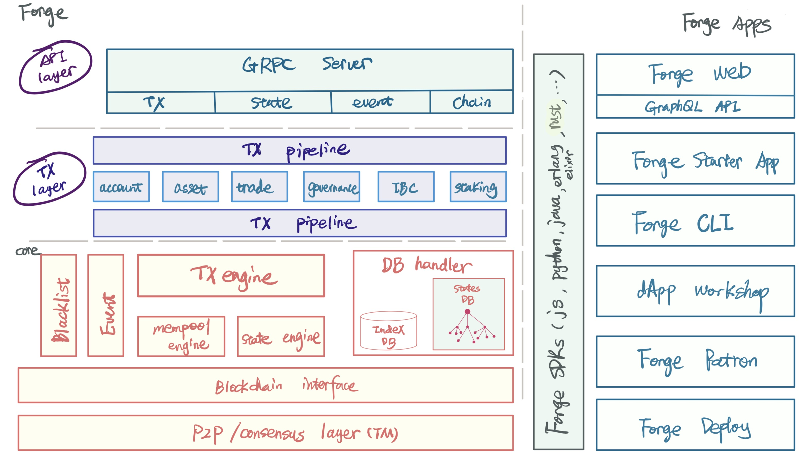

可以毫不夸张的说，**Forge CLI 是区块链应用开发的瑞士军刀，用端到端的方式为开发者交付区块链应用的过程赋能**，包含如下这些开箱即用的功能：

- 管理你的链节点：包括开发环境、生产环境
- 进行链上数据读写：区块、交易、账户、合约、资产等
- 操作钱包和账户（Wallet 和 Account）
- 完成智能合约的编译、部署和管理
- 使用基石程序（Blocklet）进行快速开发
- 使用区块浏览器、模拟器及 dApps Workshop

这些功能会在开发、部署、运行区块链应用的过程中提供帮助，比如创建测试用的链节点、部署到生产环境可用的多节点链、使用基石程序快速开发等等。

## 常说的 Forge 到底是啥？

我们在讨论 Forge 的时候到底在说什么呢？取决于谈论的上下文，Forge 可能具体指代的东西略有不同。

- 即可以狭义的指 Forge 框架本身，定义、封装、实现了链节点的基本架构、交易处理流程、扩展方法
- 也可以广义的统称围绕 Forge 框架而开发的各种区块链工具组成的工具集

Forge 的多重含义在下面这行图有很清晰的体现：

- 左侧是 Forge 框架本身，有时候我们也会把他叫做 Forge 内核、或者 Forge 核心
- 右侧是构建在 Forge 框架和 之上的能简化开发者上手难度、自动化重复性任务的工具

Forge CLI 是众多 Forge 工具中的一个，也是开发者使用 Forge 及其周边工具的入口，把他比作区块链开发的瑞士军刀也不为过，因为安装 Forge CLI 之后，就可以方便获取和使用整个 Forge 工具箱。

::: success
**包含特定版本 Forge 内核和各组件的集合组成一个 Forge 发行版本，我们说"安装 Forge"的时候，指的是安装 Forge 的一个发行版本，关于 Forge 发行版本的更多细节请[猛击这里](../../4-manage-forge-release)。**
:::
