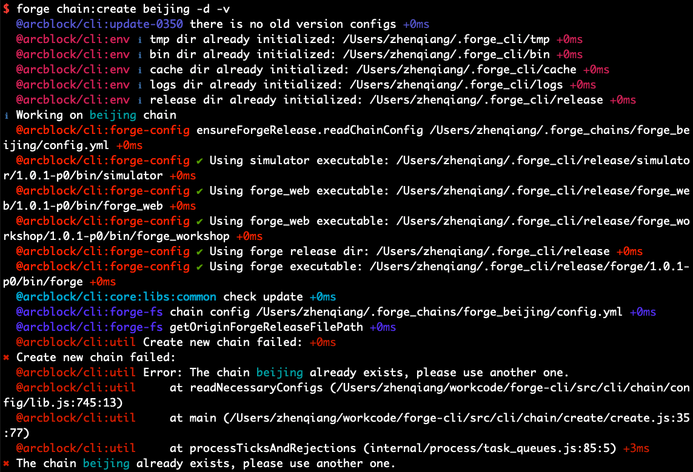

如果在使用 CLI 过程中如果出现了错误，可以通过下面的方法来定位、解决问题。或者在 Github 上给我们提 [issue](https://github.com/ArcBlock/forge-cli/issues).

## 日志

CLI 提供了 `forge logs <log type>` 命令来**动态**地打印出当前生产出来的日志，可以根据具体的需求来打印需要的日志。

``` bash
Usage: logs [type]

Show logs for various forge components

Options:
  -h, --help  output usage information

Examples:
  - forge logs               display all logs
  - forge logs transaction   display forge transaction log
  - forge logs error         display forge error log
  - forge logs tendermint    display tendermint logs
  - forge logs cli    display cli error logs
```

日志主要分为链相关日志和CLI自身的日志。

### 链相关的日志

链相关的日志主要分为 `transaction`, `tendermint` 和 `error`。

- `transaction` 是 Forge 输出的日志，Forge 在运行过程中出现了异常(如果有)、出块信息等业务日志都会打印在 `transaction` 日志中，可以通过查看该日志来判断是否有问题。该错误日志保存在 `~/.forge_chains/forge_<Chain Name>/forge_release/core/logs/transaction.log` 文件中。

- `tendermint` 是共识引擎 Tendermint 输出的日志，所有和它相关的日志都会打印在这里。该错误日志保存在 `~/.forge_chains/forge_<Chain Name>/forge_release/tendermint/logs/tendermint.log` 文件中。

- `error` 也是 Forge 输出的日志，和 `transaction` 日志不同的是，`error` 更多的是 Forge 自身的错误日志，比如无法启动链、链异常退出等等。该日志存储在 `~/.forge_chains/forge_<Chain Name>/forge_release/core/logs/forge_error.log` 文件中。

### CLI 自身的日志

相对于链来说，CLI 自身的错误信息一般会直接输出到终端，更详细的错误信息（错误堆栈等信息）会保存在 `~/.forge_cli/logs/error.log` 文件中。

## Verbose 模式

CLI 还提供了一个 `-v` 参数来使用 verbose 模式执行 CLI 命令，该模式会将 CLI 执行的过程中的细节打印到终端。这个功能对于定位 CLI 的问题很有帮助。

比如:



## 如何提交工单

如果通过上述手段还是无法解决出现的问题，或者有新的功能需求，可以通过给 CLI 提 issue 的方式来告诉我们，issue 地址:

https://github.com/ArcBlock/forge-cli/issues

为了方便我们定位问题，或者了解开发者的需求，需要开发者提供尽可能更多的信息。

对于发现的 bug 来说，需要开发者提供:

1. bug 出现的现象？
2. 如何复现?
3. 相关的错误日志？
4. CLI/Forge 的版本信息？
5. 截图或者更多的信息。

如果是新的需求，需要提问者提供：

1. 描述该需求的具体细节
2. 该需求解决的问题？
3. 是否已经考虑了如何实现该需求？

当然，对于不同的场景，上面的这些点可能不必一一列出，但是对于我们的维护者来说，越详尽的信息对解决 bug 越有帮助，对所需要的需求也会有更准确的判断。
