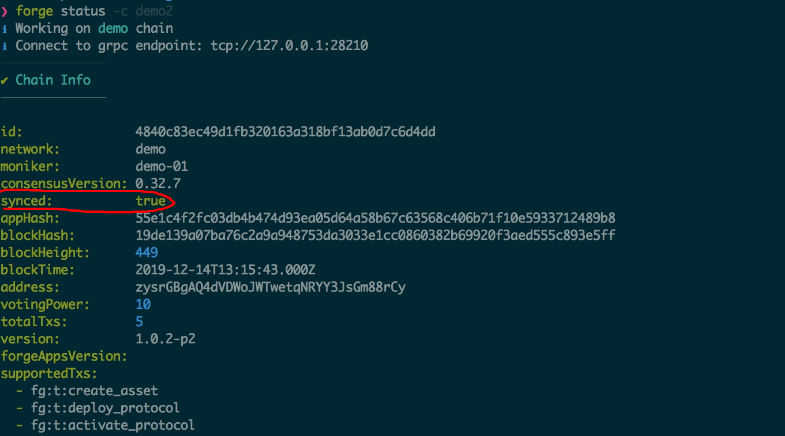
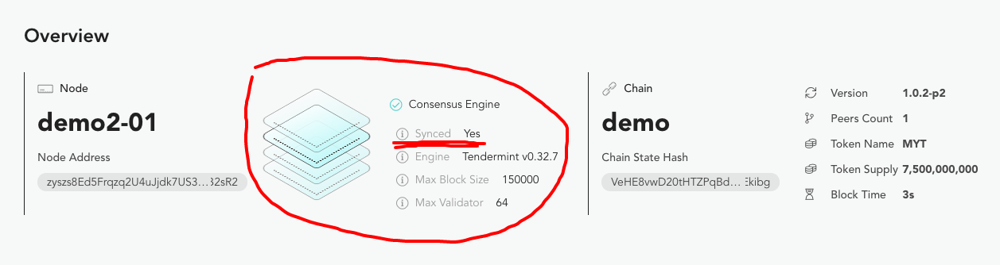

## 为什么更新验证人节点

Forge 链启动之后因为业务需要，或者参与节点发生变化，需要更新验证人节点列表是很常见的需求，节点更新的主要类型有：

- 新节点需要加入，节点越多越去中心化
- 旧节点需要退出，比如运行节点的机器到期需要更换服务商
- 已有节点权重调整，这样可以更新不同节点出块时的投票权

## 开始前的注意事项

::: warning
添加、删除、更新验证人节点功能在 Forge v1.0.2-p2 和 Forge CLI v1.0.12 之后才支持，如果你的链使用的 Forge 版本低请参照[链的软升级](../../2-manage-chain-node/upgrade-chain)来升级，如果你的 Forge CLI 版本低，请参照[如何安装 Forge CLI](../../1-introduction/install-forge-cli)来升级到最新版。
:::

::: warning
因为节点更新本质上也是在更新链的共识，所以操作本身是需要链管理员私钥去做签名，如果你还不清楚链管理员是啥，可以先去读读[链的初始化配置](../../1-introduction/initial-setup)。
:::

为方便阅读，下面的文档中有这样的术语约定：

- `网络`：需要更新验证人节点的 Forge 链，不要求链有多个节点，可以逐步添加
- `节点`：需要更新的节点，可以是待加入网络的节点、也可以是待删除的节点、也可以是待更新的节点

## 添加验证人节点

添加验证人节点的步骤稍微多一点，但是 Forge CLI 基本都能协助完成。下面是具体步骤：

### 1. 确保节点和网络同步

该步骤要求待加入节点达到如下状态：

- 节点和网络中的其他出块节点已经连接，不要求连接全部节点
- 节点已经同步了网络的配置、历史区块、交易数据，即要成为验证人节点，需要先成为[观察者节点](../join-existing-network)
- 网络中的部分节点可以与待加入节点建立 P2P 连接的

要达到这个状态有至少两种不同的做法：

- 使用 `forge join <endpoint>` 来让待加入节点成为网络的[观察者节点](../join-existing-network)，然后等待历史区块和交易同步完成
- 如果能访问网络中现有节点的磁盘数据，直接把数据和配置拷贝到待加入节点的机器上，启动节点完成同步即可

验证节点是否达到同步状态的方法有两种：

- 执行 `forge status`，就能看到节点同步状态，如下图：
  
- 执行 `forge web open` 直接从节点控制面板查看同步装填，如下图：
  

### 2. 在网络上注册节点

因为验证人节点在打包交易的过程中会为自己的提案签名，而其他节点需要验证这个签名，这就需要待加入的节点把自己的公钥、地址信息公开注册到链上，而每个节点的私钥存储在自己的宿主机磁盘上，在节点和网络同步的情况下，直接在待加入节点的上执行如下命令即可完成链上注册：

```shell
forge declare:node --validator
```

执行这个命令的输出如下：

```terminal
❯ forge declare:node -c demo3 --validator
ℹ Working on demo3 chain
ℹ Connect to grpc endpoint: tcp://127.0.0.1:28212
⚠ Declare Validator can only be done on the node host machine
ℹ Validator address is zysioYXdQsTHykUgY1wLYKvxQGs3zqiYM3eZ
✔ Validator successfully declared on chain
ℹ Run forge tx 8CCADF7ECC607E9635D8AFD944BE0FF619ADDE6261E9ED59914C1CD63089C8C7 to check transaction
ℹ Run forge account zysioYXdQsTHykUgY1wLYKvxQGs3zqiYM3eZ to check account state
```

::: warning
如果你本地启动过多条链，需要执行 `forge declare:node -c chainName --validator`
:::

### 3. 添加验证人节点

接下来就可以把节点添加到网络的验证人列表了，执行如下命令：

```shell
forge chain:validator -c demo --address zysioYXdQsTHykUgY1wLYKvxQGs3zqiYM3eZ --power 10
```

这里的 `address` 参数就是新节点的地址，而 `power` 参数就是新节点的投票权重，Forge 链节点默认投票权重都是 `10`。

## 更改验证人节点

更新节点权重的命令非常类似：

```shell
forge chain:validator -c demo --address zysioYXdQsTHykUgY1wLYKvxQGs3zqiYM3eZ --power 20
```

## 删除验证人节点

直接将验证人节点的投票权重设置为 `0`，就可以删除掉验证人节点，具体命令如下：

```shell
forge chain:validator -c demo --address zysioYXdQsTHykUgY1wLYKvxQGs3zqiYM3eZ --power 0
```

## 实操步骤详解

同时为了方便读者更容易理解整个过程，读者可以跟着下面的步骤在**单台机器上**做节点添加的试验：

1. `forge install latest`，安装最新的 Forge 版本
1. `npm install -g @arcblock/forge-cli`，安装最新的 Forge CLI
1. `forge chain:create demo -d`，创建第 1 个节点
1. `forge start demo`，启动第 1 个节点，这样我们就有了单节点的网络，网络中有 1 个节点负责出块
1. `forge chain:create demo2 -d`，创建第 2 个节点
1. `forge join http://localhost:8210/api --yes`，把第 2 个节点加入到第 1 个节点的网络中
1. `vim ~/.forge_chains/forge_demo/forge_release.toml`，把 `tendermint.persistent_peers` 里面的 IP 地址修改为 `127.0.0.1`，否则第 2 个节点会无法连接到第 1 个节点
1. `forge start demo2`，启动第 2 个节点，如果你的操作速度很快，第 2 个节点很快就能达到同步状态
1. `forge declare:node -c demo2 --validator`，在链上注册地 2 个节点，等待交易完成，拿到节点地址 `address`
1. `forge chain:validator -c demo --address <address> --power <power>`，等待交易完成，就完成了节点添加
1. `forge web open -c demo` 打开第 1 个节点的区块浏览器，查看最新的交易和区块
1. `forge web open -c demo2` 打开第 2 个节点的区块浏览器，查看最新的交易和区块，不出意外的话，两边看到的数据是相同的
