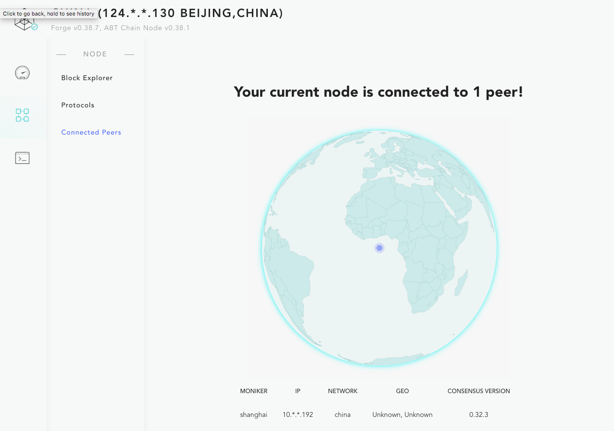
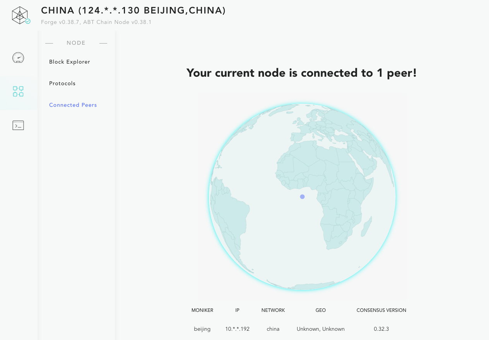

## 基本步骤

在 [部署多节点的私链](../deploy-multi-node-network) 中我们部署的链的节点都属于一方，但是现实世界的实际情况常常不是这样，多个利益相关方聚在一起启动一条共建共享的链，因为每个节点的私钥都有可能属于不同的参与方，所以这个过程需要部分手动步骤才能完成，描述如下：

- 所有的节点参与方都安装相同版本的 Forge CLI 和相同版本的 Forge
- 所有的节点参与方准备好运行节点的机器，机器的网络条件需要满足节点间相互可达
- 选出牵头节点负责收集各节点的验证人信息（这个信息不包括节点私钥，各节点私钥由各节点自己保存）
- 各节点初始化自己的验证人信息：`forge deploy:prepare`，把验证人信息发给牵头节点
- 收集到所有节点的验证人信息之后，组装一个正确的配置文件，同步给所有的参与节点
- 所有的参与节点拿到配置之后启动各自的节点：`forge start`，链就算是启动了

## 视频教程

为了方便说明整个过程，下面我们假设要启动一条名称为 `china` 的链，这个链包含两个节点：`beijing` 和 `shanghai`，整个配置过程如下：

!TerminalPlayer[](./images/multi-party-network.yml)

关于这个演示过程的节点描述：

- `forge chain:create beijing -d`: 创建 `beijing` 节点
- `forge chain:create shanghai -d`: 创建 `shanghai` 节点
- `forge deploy:prepare -c beijing --mode init --write-config`: 初始化 `beijing` 节点，验证人信息会直接写到配置里面
- `forge deploy:prepare -c shanghai --mode init`: 初始化 `shanghai` 节点，验证人信息会直接打印到终端里面
- `forge deploy:prepare -c beijing --mode join`: 更新 `beijing` 节点，把 `shanghai` 节点的链接串、验证人信息加进去
- `forge chain:config -c beijing | grep 'config file path'`: 找到 `beijing` 节点的配置文件路径
- 同样的找到 `shanghai` 节点的配置文件路径，并且把两个配置文件里面的 `chain_id` 修改为 `china`，这是我们的链的名字
- 然后把 `beijing` 节点配置文件中的 `connection_string` 和 `terdermint.genesis.validators` 复制到 `shanghai` 节点的配置中
- `forge start beijing`: 启动 `beijing` 节点
- `forge start shanghai`: 启动 `shanghai` 节点
- `forge status net -c beijing`: 查看 `beijing` 节点的网络信息，可以看到 `peer` 里面有 `shanghai` 节点
- `forge status net -c shanghai`: 查看 `shanghai` 节点的网络信息，可以看到 `peer` 里面有 `beijing` 节点

## 效果验证

接下来，如果执行：

```shell
forge web open -c beijing
forge web open -c shanghai
```

并且打开区块浏览器下面的 ["connected peers" 页面](http://127.0.0.1:8211/node/status)，能看到下面两张图：





可以确定我们的多参与方的网络启动成功了。

可能你已经注意到，整个配置过程中，在链配置文件中传递的都是节点的公开信息，比如链接信息、地址、名称等，而不包括私钥。在实际部署的过程中，`beijing` 和 `shanghai` 节点的操作应该是不同的人来完成，各节点的公开信息可以安全的在网络上传递，汇聚成整条链的配置文件之后，就可以启动这条链了。

::: warning
链的大部分配置，除了端口、文件存储路径之外的部分都会写到链状态里面，需要确保链启动之前这些配置准确无误，如果启动之后要去修改链，就需要把链停止掉重新配置启动。
:::
