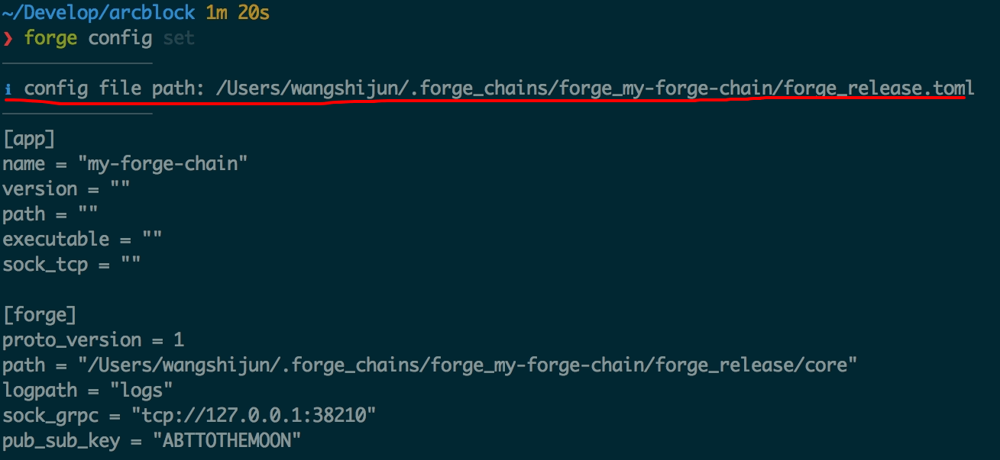
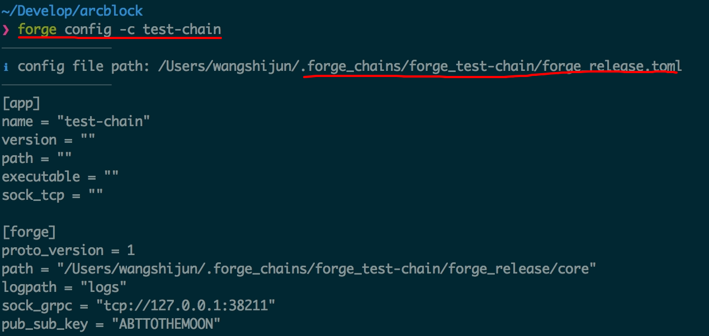

## 初始化链节点配置

从配置项是否需要在节点间达成共识（即保持一致）的角度，我们可以把配置项分为两类：

- 属于整条链的配置：比如链的名称、链的验证人信息、链上的通证信息、[管理员信息](../../1-introduction/initial-setup)，这类配置在链启动之后通常是不能再通过配置文件修改的，因为这样会破坏共识，类似于修改比特币网络中的区块大小
- 属于单节点的配置：比如节点名称、节点数据的存储目录、节点对外接口所监听的端口等，这类配置在节点启动之后还是可以修改的，不过绝大多数时候修改完配置需要重启节点才能生效

链的[配置参数](https://docs.arcblockio.cn/zh/docs/instruction/configuration)比较多，这些配置项都可以在创建时通过 Forge CLI 来调整。

在 [快速入门](../../1-introduction/getting-started) 里面我们使用 `forge chain:create my-forge-chain -d` 在默认配置下创建了一条链，这里的 `-d` 就是告诉 Forge CLI 全部使用默认配置的意思。

去掉 `-d` 参数，使用新的链名称（Forge CLI 不允许创建同名的链），再次执行命令 `forge chain:create test-chain`，可以交互式的配置我们的链。如下：

!TerminalPlayer[](./images/4-create-chain.yml)

关于自定义配置的部分，我们逐行解释如下：

1. chain name: **test-chain**：链的名称为 test-chain，节点的名称也是这个
1. Please input block time (in seconds): **5**：出块时间为 5 秒
1. Do you want to customize token config for this chain? **Yes**：选择自定义链上的币
1. What's the token name? **Test Chain Token**：币的名称
1. What's the token symbol? **TCT**：币的符号，至少 3 个字符
1. What's the token icon? **/Users/wangshijun/.forge_cli/tmp/token.png**：币的图标文件路径，建议是正方形的 PNG 图片
1. Whats the token description? **Token on test chain**：币的描述
1. Please input token total supply: **1000000000**：币的总供应量是 10 个亿
1. Please input token initial supply: **1000000000**：币的初始供应量是 10 个亿
1. Please input token decimal: **18**：币的精度是小数点后 18 位
1. Do you want to enable "feel lucky" (poke) feature for this chain? **Yes**：允许用户签到领币
1. Do you want to customize "feel lucky" (poke) config for this chain? **Yes**：需要自定义签到领币的参数
1. How much token to give on a successful poke? **10**：每次签到领币 10 个
1. How much token can be poked daily? **100000**：每天最多放出去 10000 个
1. How much token can be poked in total? **146000000**：允许签到领币放出去的最多的币数量
1. Do you want to include moderator config in the config? **Yes**：自动包含链管理员信息
1. Set moderator as token owner of (854000000 TCT) on chain start? **Yes**：把剩余的币放到链管理员账户里面，可以用程序转走

关于上面这些问题的补充说明：

- 第 17 个问题，可以选择否，这样就需要我们自己设定一个创世的持币者，因为币的初始发行量为 10 亿，签到领币最多放出去 1.46 亿，还剩下 8.54 亿需要需要存放到某个你掌握私钥的账户里面才能使用，否则这个币就相当于在网络里面永久锁定无法流通了。

## 查看链节点配置

新创建链的配置存放在什么地方？内容是什么样的呢？直接执行 `forge config` 就能把配置文件的路径和内容打印到终端里面，如下截屏：



细心的同学可能会看到，执行 `forge config` 的时候，打印出来的配置文件是 `my-forge-chain` 的配置文件，而不是我们刚刚创建的 `test-chain`。

那么如何查看 `test-chain` 的配置呢？Forge CLI 默认是支持多链的（详细文档参考[这里](../../9-customization/multi-chain)），可以执行 `forge config -c test-chain` 来查看 `test-chain` 的配置，如图：



::: warning
关于 Forge CLI 多链支持的功能细节和详细语法请参考[这里](../../9-customization/multi-chain)。
:::

## 修改链节点配置

既然创建时可以自定义链的配置，创建完之后呢？也是可以的，直接执行 `forge config set` 会出来 `forge chain:create` 类似的交互式界面，不同的是，这次不是全新的参数配置，而是在旧配置的基础上修改，需要注意的是，修改某条链的配置需要把节点停下来，并且链级别的配置一旦启动之后修改是无法生效的。

比如我们如果要修改 `test-chain` 的币符号为 `TTC`，执行 `forge config set -c test-chain`，过程如下：

!TerminalPlayer[](./images/5-config-set.yml)

修改完之后，可用如下命令去验证：

```shell
❯ forge config -c test-chain | grep TTC
  symbol = "TTC"
```

## 全面理解链节点配置

Forge CLI 支持的链节点配置只是 Forge 所支持的配置项中最关键的一部分，关于完整的配置项列表，可以猛击[这里](https://docs.arcblockio.cn/zh/docs/instruction/configuration)
