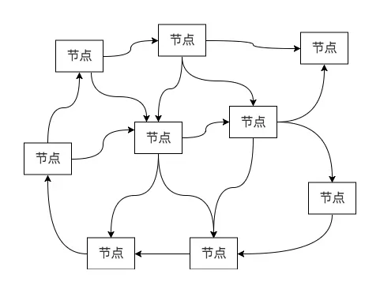

在我们继续深入了解 Forge CLI 的连接点运维功能时，有必要澄清下**链**和**节点**这两个概念。

## 链和节点的区别

金融视角下，绝大多数运行中的公**链**都是公开的账本，组成这些链的**节点**是负责维护账本的记账人。

技术视角下，**链**本质是 P2P 网络系统，**节点**是组成这个网络的成员，节点之间通常是不相互信任的，节点需要运行相同的区块链软件（比如 Forge）。

## 链和节点的联系

**链**中的所有**节点**都保存了这条链在某个时间点的状态副本，即公开账本的全部数据。这里说的某个时间点而不是最新的状态，是因为不同节点间数据同步的非实时性。用 Forge 启动的链节点都需要使用相同版本的 Forge，因为不同版本的 Forge 处理某些交易的流程可能不同。

