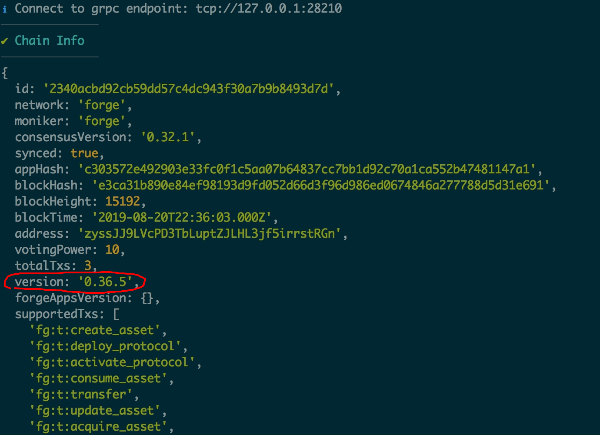
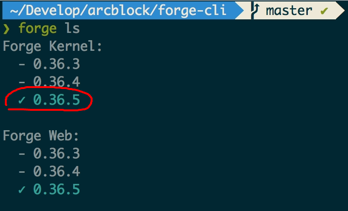
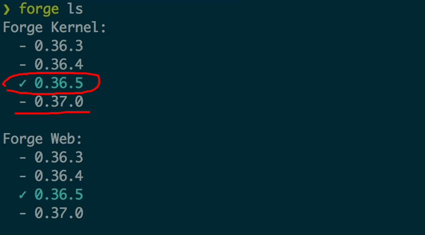

在[如何获取最新版的 Forge](/tutorials/hard-upgrade)中我们介绍了如何进行 Forge 链的硬升级（需要重置本地链的状态），硬升级的做法在开发环境下比较方便，相当于清空数据库的记录。

而有些时候，可能你的测试链跑了一段时间，上面产生了不少测试数据，重新产生这些测试数据可能费时费力，你既希望升级到最新版的 Forge，又希望保留之前启动过的链的状态，鱼与熊掌可以兼得么？答案是**肯定的**，接下来我们来讨论具体的操作步骤。

在介绍升级步骤之前，我们有必要再次强调下链的升级在不同上下文的区别：

- 在开发环境我们可以毫无顾虑的进行链的重置、升级、启停，因为你不会影响到其他人或者用户
- 在生产环境，因为整个区块链是分布式的网络，升级的动作需要由链的运营者来决定，而升级的结果需要在整条链的所有节点间同步

本文探讨的是前面一种情况，即开发环境下的具体做法。

## 准备工作

Forge CLI 是 ArcBlock 官方开发和维护的管理本地 Forge 链、节点的命令行工具，建议定期升级 [Forge CLI](https://github.com/ArcBlock/forge-cli) 到最新版本：`npm install -g @arcblock/forge-cli`。

## 了解 Forge 最新版本

你读到这篇文章时，已经发布的最新的 Forge 版本是：。

## 了解 Forge 本地版本

如果你想知道本地 Forge 链的版本，直接运行：`forge status`，得到如下执行结果：



其中红色圈圈中的版本就是当前链所使用的版本，我本地链的版本是 `v0.36.5`。

当然，你也可以执行：`forge ls`，得到如下执行结果：



其中红框圈出的版本也是当前链使用的版本，`forge ls` 会列出本地已经下载过的所有可使用的 Forge 版本，并把当前使用的版本高亮出来。

升级的前提是我们本地使用的版本比远程的最新版本低，如果两个版本相同的话，你可以到此打住啦，哈哈！

## 下载 Forge 最新版

如果要把本地 Forge 链从 `v0.36.5` 升级到 `v0.37.0`，需要先下载 Forge  `v0.37.0` 的全部组件，执行如下命令：

```shell
forge download latest

# 中国用户
forge download latest --mirror http://arcblock.oss-cn-beijing.aliyuncs.com
```


可能有人会问，`forge download` 和 `forge install` 有啥区别？两者都会从我们的镜像下载指定版本（或最新版）的 Forge，不同点在于 `forge download` 只会下载，而 `forge install` 下载完之后会把本地使用的 Forge 版本切换到刚下载的版本，硬升级的时候用的就是 `forge install`。

怎么确定有没有切换本地当前使用的 Forge 版本？再次执行 `forge ls`：



可以看到，被高亮的还是 `v0.36.5`。

## 重新启动

因为我们添加管理员的操作修改了链的配置，为了是配置生效，需要重新启动 Forge 链，依次执行如下两条命令：

```
forge stop
forge start
```

重新启动之后，包含了管理员的配置被加载到 Forge 的运行配置中，接下来我们就可以以管理员的身份往链上发送升级的指令。

## 开始升级

万事俱备，接下来再次运行：`forge upgrade`，如下图需要做出几个升级的配置：

- 要升级到的版本，选择 `v0.37.0`
- 在哪个块高升级，可以根据当前的块高加上适当的增量，比如当前块高 `33`，我们就在 `53` 块高出升级，如果出块时间配置的是 3 秒，意味着 1 分钟之后会发生升级
- 确认升级操作，因为这个操作是不可逆的，如果到这里后悔了，输入 `N` 或者 `Ctrl + C` 即可中止


回车确认之后，Forge CLI 会用管理员的身份往 Forge 链发送 1 个 `UpgradeNode` 的交易，交易被成功打包之后，Forge 链会在预设的高度停下来，然后 Forge CLI 检测到 Forge 链完全停止之后会再次把链启动起来，这样就完成了整个升级的过程。

## 验证升级

如何验证升级是成功的呢？再次执行 `forge status`，


检查当前链状态里面的版本号，已经变成了升级后的版本。

## 如果遇到问题？

到这里，Forge 链软升级的准备、升级、验证环节都走完了，你升级成功了么？如果遇到问题，欢迎到 [Forge CLI](https://github.com/ArcBlock/forge-cli) 的官方仓库提 Issue。
