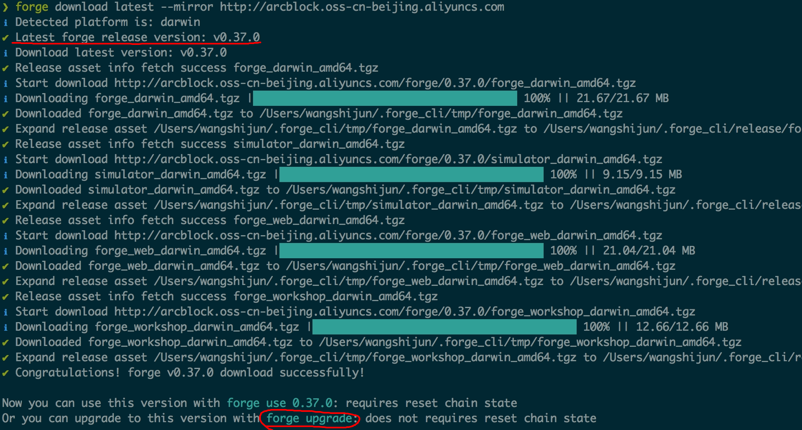
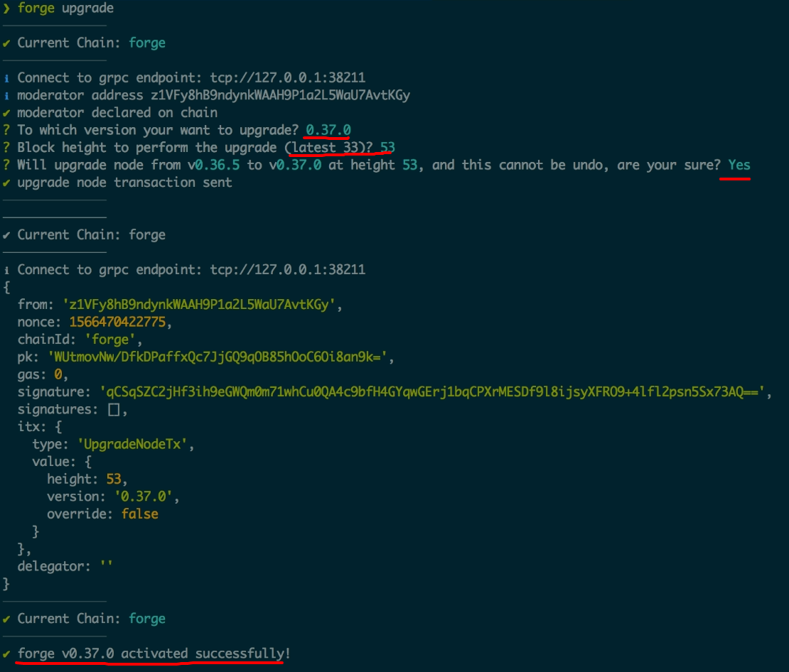
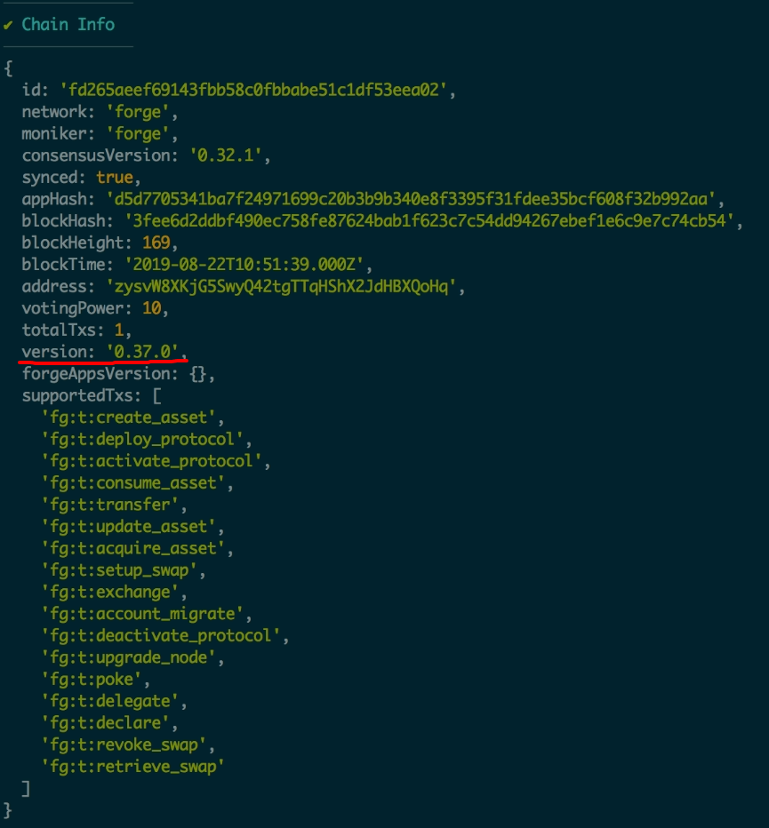

Forge 是原生支持做链上升级了，即在不清掉链的数据而把链节点所运行的 Forge 从低版本更新到高版本，接下来我们来讨论具体的操作步骤。

在介绍升级步骤之前，我们有必要再次强调下链的升级在不同上下文的区别：

- 在开发环境我们可以毫无顾虑的进行链的重置、升级、启停，因为你不会影响到其他人或者用户
- 在生产环境，因为整个区块链是分布式的网络，升级的动作需要由链的运营者来决定，而升级的结果需要在整条链的所有节点间同步

本文探讨的是前面一种情况，即开发环境下的具体做法，当然生产环境也可以参考。

## Forge 最新版本

你读到这篇文章时，已经发布的最新的 Forge 版本是：

升级的前提是有比我们当前使用的版本更新的版本。

## 升级的操作步骤

### 下载新版 Forge

如果要把本地 Forge 链从 `v0.36.5` 升级到 `v0.37.0`，需要先下载 Forge `v0.37.0` 的全部组件，执行如下命令：

```shell
forge download v0.37.0

# 中国用户
forge download v0.37.0 --mirror https://releases.arcblockio.cn
```



::: warning
注意，这里需要使用 `forge download` 而不是 `forge install`，关于两者的区别可以参见[这里](../../4-manage-forge-release/download-install-release)。
:::

### 执行升级操作

万事俱备，接下来再次运行：`forge upgrade`，如下图需要做出几个升级的配置：

- 要升级到的版本，选择 `v0.37.0`
- 在哪个块高升级，可以根据当前的块高加上适当的增量，比如当前块高 `33`，我们就在 `53` 块高出升级，如果出块时间配置的是 3 秒，意味着 1 分钟之后会发生升级
- 确认升级操作，因为这个操作是不可逆的，如果到这里后悔了，输入 `N` 或者 `Ctrl + C` 即可中止



回车确认之后，Forge CLI 会用管理员的身份往链上发送 1 个 `UpgradeNode` 的交易，交易被成功打包之后，Forge 链会在预设的高度停下来，然后 Forge CLI 检测到 Forge 链完全停止之后会再次把链启动起来，这样就完成了整个升级的过程。

### 验证升级结果

如何验证升级是成功的呢？再次执行 `forge status`，



检查当前链状态里面的版本号，已经变成了升级后的版本。

## 升级常见问题？

### 因为没有新版本而退出

`Abort because no available newer version to upgrade` 表示没有更新的版本可以升级，需要先使用 `forge download` 去下载。

### 因为没有管理员私钥而退出

Forge 要求诸如升级这样的高权限操作必须由管理员来的私钥签名，如果没有的话需要按这两个文档去配置：

- [初始化配置](../../1-introduction/initial-setup)
- [全局配置](../../9-customization/global-config)

### 因为管理员地址不匹配而退出

如果 Forge CLI 能读取到的管理员私钥派生出来的 DID 和链上的管理员 DID 不匹配，那么大概率是读取到的管理员私钥是错误的，因为 Forge 在校验高权限操作的交易时需要用从私钥派生出来的公钥和地址去做校验，如果对不上，交易肯定会失败，升级也就无法进行。

## 如果遇到问题？

到这里，Forge 链软升级的准备、升级、验证环节都走完了，你升级成功了么？如果遇到问题，欢迎到 [Forge CLI](https://github.com/ArcBlock/forge-cli) 的官方仓库提 Issue。
