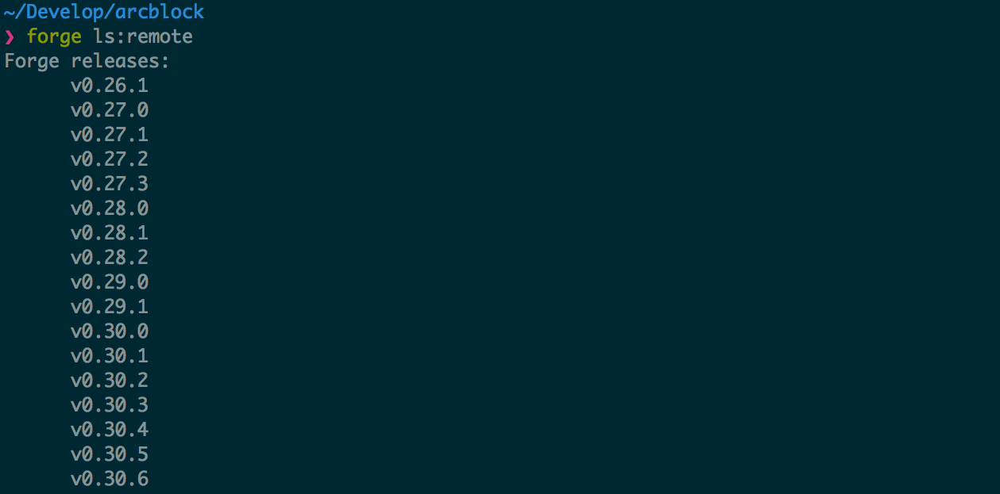

## use `forge ls` View installed Forge

If you want to see which versions of Forge have been installed locally, you can execute: `forge ls`The output is shown below:

The version highlighted here is the most recently used `forge install` The version installed to the local is also executed `forge chain:create` The Forge version used by default.

## use `forge ls:remote` View published Forge

Forge has new versions every week. How can I see which versions we have released? carried out `forge ls:remote`To get the full Forge release

Similarly, this list will mark the locally installed versions.
