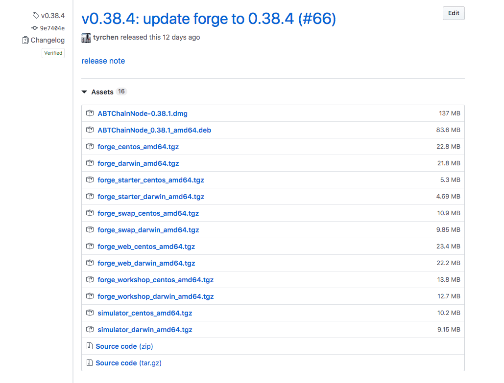

Forge 发行版本可以认为是一个容器，容器里面装着 Forge 内核以及围绕其开发的各种工具。

随着产品和技术的迭代，Forge 发行版本里面从开始的只包含 Forge 内核，到现在包含如下组件：

- Forge 内核: 交易处理引擎、和共识引擎、数据存储层的交互，每周会有大小版本发布
- 核心智能合约: Forge 内置的交易合约，能够帮助开发者解决 99% 的账户、交易、跨链、链上治理等业务逻辑，随着 Forge 同步发版
- Forge Desktop：桌面版链节点，随着 Forge 同步发版
- Forge Web: Forge 链节点的 Web 管理界面和区块浏览器，使用方法参考[这里](../8-explorer-other-tooling/forge-web)，随着 Forge 内核同步发版
- Forge SDK: 各种语言的 SDK，目前支持的语言包括 Elixir、Javascript、Java、Python、Rust，除 Elixir 与 Forge 同步发版之外，其他语言的 SDK 采用的是跟随发版
- Forge Simulator：流量模拟器，使用方法参考[这里](../8-explorer-other-tooling/simulator)
- dApp Workshop：dApp 原型工坊，跟随 Forge 发版
- Forge Patron：集成测试工具，目前尚未公开发布
- Forge Deploy：生产环境大规模部署的工具内部使用 Ansible，，目前只支持部署私链，可以从 [ArcBlock/forge-deploy-public](https://github.com/ArcBlock/forge-deploy-public) 获取源码
- Forge Compiler：智能合约编译工具，跟随 Forge 发版，在 Forge CLI 里面可用，具体参见[这里](../6-working-with-contracts)

在 GitHub 上我们的一个 Forge 发行版本是这样的：

关于 Forge 发行版本有以下几个重要事实：

- Forge 发行版本目前只支持 MacOS、CentOS、Ubuntu 等 Linux 系统，不支持 Windows
- Forge 发行版本里面只包括各个工具的可执行文件或者编译后的代码，不包括源代码
- Forge 发行版本存储在 [releases.arcblock.io](http://releases.arcblock.io/forge) 上供开发者下载使用
- Forge 发行版本的最新版可以从 [latest.json](http://releases.arcblock.io/forge/latest.json) 查到
- Forge 发行版本的完整历史可以从 [versions.json](http://releases.arcblock.io/forge/versions.json) 查到
- 部分 Forge 工具箱的组件还不包含在 Forge 发行版本中，比如 Forge Deploy、Forge Patron
- 为保障中国大陆开发者的下载速度，我们在阿里云上做了发行版的镜像 [releases.arcblockio.cn](https://releases.arcblockio.cn/forge/latest.json)

::: success
**Forge CLI 只是方便开发者获取 Forge 发行版本、使用发行版本内含组件的桥梁，为避免啰嗦和保持统一，后文中将用 `Forge` 来代称 Forge 的发行版本，小写的 `forge` 则指的是安装完 Forge CLI 之后在系统中产生的那个命令行工具。**
:::
