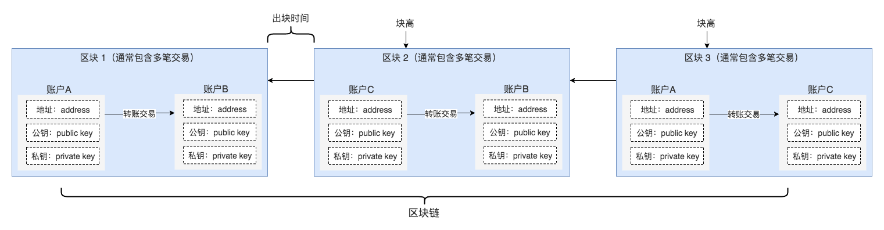

There are many concepts and terminologies in the field of blockchain, but the core ones are: accounts, transactions, blocks, and chains (for interested students, see Bitcoin's [Vocabulary](https://bitcoin.org/en/vocabulary) with [Developer Glossary](https://bitcoin.org/en/developer-glossary)), A correct understanding of these core concepts can help us to carry out more smoothly in later practice.

Blockchain is a ledger. The industry often compares it to a banking system. The concepts that exist in the banking system also exist in the blockchain system. You can use the concepts in the bank ledger to understand the core concepts of the blockchain by analogy:

- Account (Account) is the combination of the user's bank account and password in the blockchain world, as well as in the blockchain world. Both Bitcoin and Ethereum accounts are composed of address, public key, and private key. The address is equivalent to User name, and the public key + private key is equivalent to the password, especially the private key. Losing or leaking means losing control of the account (sensitive information, funds);
- Transaction is any record of income and expenditure in the ledger. In the blockchain world, it can refer to a transfer transaction between two accounts or a smart contract call request;
- A block is a page in the ledger. Each page of the ledger may contain multiple incomes and expenses. Similarly, each block in the blockchain may contain multiple transactions.
- Blockchain is a multi-page ledger bound into books. Different pages of the ledger are organized according to the recording time. Different blocks in the blockchain are organized according to the time that the miners packed them.

If you use diagrams to identify these concepts and their relationships:

Regarding how the block is produced, how to implement an immutable implementation mechanism, and the validity verification of transactions involves cryptographic knowledge. There is not much expansion here. Interested students can move to the following resources to learn:

- Interactive Blockchain Core Technology Learning Website [Blockchain demo](https://anders.com/blockchain/), Recommended 5 stars
- Open courses at Princeton University [Bitcoin and Cryptocurrency Technologies](https://www.coursera.org/learn/cryptocurrency), Recommended 5 stars

## Accounts and wallets in Forge?

In Forge, if an account needs to transact with other accounts, it needs to hold its own public key and address to register on the chain. Because of this link, we use two names with similar meanings but different names to refer to The existence of the account:

- Wallet: The user uses a tool or a randomly generated public-private key pair. The wallet contains only public-private key pairs and can be used to sign transactions or verify other people's signatures.
- Account: Once registered on the chain, you can have transactions with other accounts, and you can also check the account status from the chain through the address. The account implies various other statuses and attributes related to him.

Blockchain wallets essentially manage public-private key pairs. Wallets used by ordinary users such as ABT Wallet and ImToken manage multiple public-private key pairs, which are more like real-world wallets.

## DID in Forge?

If you have knowledge of basic blockchain knowledge, you may ask that the wallet contains not only the private key and public key pair, but also the address. The estimated relationship between these three is: `私钥 --> 公钥 --> 地址`In the design of Forge, for the following reasons, the wallet address generation has several additional information embedded:

- The wallet public and private key algorithm in Forge supports extensions, such as currently supporting `SECP256K1`(As used by Ethereum) and `ED25519`(Higher security)
- The encoding of the wallet address in Forge supports customization. For example, it can be `base64`(Ethereum address encoding method) can also be `base58`(Bitcoin address encoding method)
- There are various types of wallets in Forge, such as user wallets, application wallets, device wallets, or contract wallets.

The above three pieces of information are encoded, and the address calculated from the public key is called DID. Any entity in the Forge system has its own DID, including nodes, contracts, accounts, assets, and so on.

::: warning
If you are interested in detailed algorithms on how to generate DIDs, you can read our article by beauty engineers: [Getting Started with DID: Making DID if you cook Xiaoxian, teach you six steps to generate your own DID](https://www.arcblock.io/zh/post/2019/05/28/did-101)。
:::
