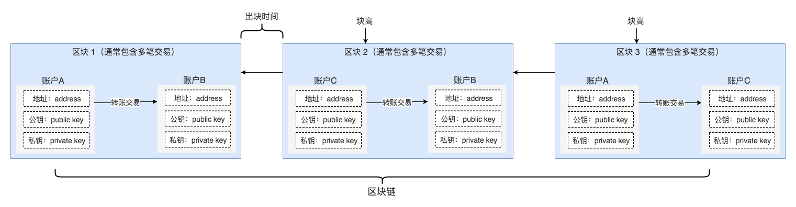

区块链领域中的概念和术语很多，但是核心的几个是：账户、交易、区块、链（感兴趣的同学可参见比特币的 [Vocabulary](https://bitcoin.org/en/vocabulary) 和 [Developer Glossary](https://bitcoin.org/en/developer-glossary))，正确理解这几个核心概念能够帮助我们在后面的实践中进行的更顺畅。

区块链是账本，业内常将其比作银行系统，那么银行系统中存在的概念在区块链系统中也会存在，可以用银行账本中的概念来类比理解区块链的核心概念：

- 账户（Account）是用户在银行的户头+密码的组合，在区块链世界中也是如此，不论是比特币还是以太坊的账户都由地址、公钥、私钥 3 部分构成，其中地址相当于用户名，而公钥+私钥相当于密码，尤其是私钥，丢失或者泄露就意味着失去账户（敏感信息、资金）的控制权；
- 交易（Transaction）是账本中的任意一条收支记录，在区块链世界中可以指两个账户之间的转账交易、或者智能合约调用请求；
- 区块（Block）是账本中的一页，账本的每页可能包含多笔收入和支出，同样，区块链中的每个区块都可能包含多笔交易；
- 区块链（Blockchain）是装订成册的多页账本，账本不同页按照记录时间先后顺序组织，区块链中不同区块按被矿工打包的时间先后组织。

如果用图来标识这几个概念及之间的关联：

关于区块怎么生产，怎么实现不可篡改的实现机制、交易的有效性验证涉及到密码学知识，这里不做过多展开，感兴趣的同学可以移步到下面几个资源去学习：

- 交互式的区块链核心技术学习网站 [Blockchain Demo](https://anders.com/blockchain/)，推荐指数 5 星
- 普林斯顿大学开设的公开课 [Bitcoin and Cryptocurrency Technologies](https://www.coursera.org/learn/cryptocurrency)，推荐指数 5 星

## Forge 中的账户和钱包？

在 Forge 里面，如果某个账户需要跟其他账户发生交易，需要拿着自己的公钥和地址去链上注册下，因为这个环节的存在，我们用含义类似但却不同的两个称呼来指代账户的存在形态：

- 钱包：用户用工具、或随机生成的公私钥对，钱包仅仅包含公私钥对，可以用来签名交易或验证别人的签名
- 账户：在链上注册过，可以和其他账户发生交易，也可以通过地址从链上查到账户状态的钱包，账户隐含了跟他有关的各种其他状态和属性

区块链钱包本质上管理的都是公私钥对，普通用户使用的钱包比如 ABT Wallet、ImToken 之类会管理多个公私钥对，更像是现实世界里面的钱包。

## Forge 中的 DID?

如果了解过基本区块链知识的同学可能会问，钱包不仅仅包含私钥、公钥对，还包含地址，这三者之间的推算关系是：`私钥 --> 公钥 --> 地址`，而在 Forge 的设计里面，出于下面几个原因，钱包地址的生成内嵌了几个额外的信息：

- Forge 中的钱包公私钥算法是支持扩展的，比如目前支持 `SECP256K1`（以太坊所采用的的）和 `ED25519`（安全性更高）
- Forge 中的钱包地址的编码是支持自定义的，比如可以是 `base64`（以太坊地址编码方式） 也可以是 `base58`（比特币地址编码方式）
- Forge 中的钱包的类型是多种多样的，比如是用户的钱包、应用的钱包、设备的钱包、还是合约的钱包等等

编码了上面三个信息，并且根据公钥推算出来的地址我们称之为 DID，任何 Forge 体系中的实体都有自己的 DID，包括节点、合约、账户、资产等等。

::: warning
如果你对如何生成 DID 的详细算法感兴趣，可以阅读我们美女工程师的文章：[DID 起步：制 DID 若烹小鲜 教你六步生成自己的 DID](https://www.arcblock.io/zh/post/2019/05/28/did-101)。
:::
