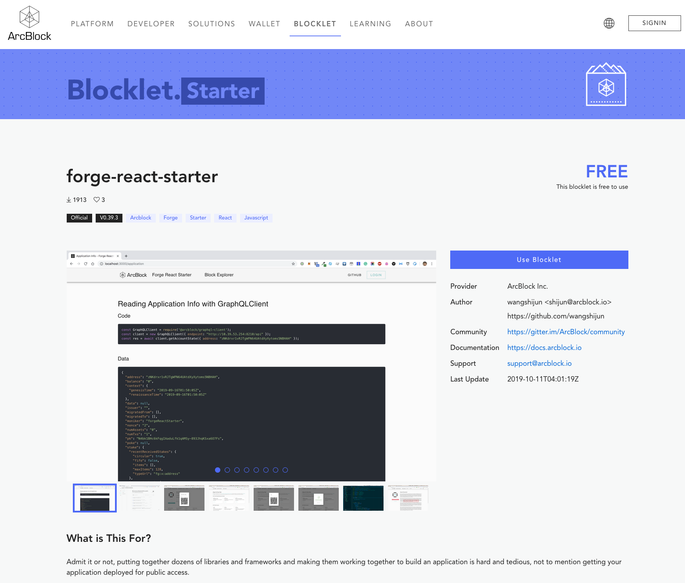

## 创建

使用 `forge blocklet:init` 命令可以初始化一个 Blocklet 项目。在初始化的过程中，有几个变量需要设置一下:

```shell
$ forge blocklet:init
This utility will walk you through create such files and folders(if not exists):
- blocklet.json
- blocklet.md
- package.json
- screenshots/
- <templates folder>/(upon your input)

It only covers common items, if you want to check all items, please visit:
https://github.com/ArcBlock/blocklets#keyinfo-blockletjson

Press ^C to quit.
? blocklet name: blocklet-demo
? Please write concise description: This is a blocklet demo
? What's group of the blocklet? starter
? Choose a color for your blocklet: primary
? Blocklet templates folder name: templates
```

- name: Blocklet 名字
- description: Blocklet 描述
- group: Blocklet 的分类，当前可选的有 `dApp | starter | contract`
- color: 选择 Blocklet 的颜色主题，当前可选的有 `primary | secondary | error`
- templates: 指定模板代码目录，如果有多个，使用逗号(`,`)分割

::: success
这里询问的只是部分常用的设置项，更详细的设置项可以看[这里](https://github.com/ArcBlock/blocklets#keyinfo-blockletjson)。
:::

命令顺利执行完后会生成如下几个文件和目录：

```shell
├── blocklet.json
├── blocklet.md
├── package.json
├── screenshots/
└── templates/
```

::: success
当然，如果不想这么麻烦，可以使用 forge blocklet:init -y|-d 来使用默认参数完成初始化。
:::

### 这几个文件（目录）都有什么用？

#### blocklet.json

这个文件是 Blocklet 的核心文件，对于 Blocklet 的解析都是基于该文件的。
该文件提供了 Blocklet 的`名字`，`类型`，`作者`等元信息，同时也包含基于该 Blocklet 创建一个应用所需要的脚本(详见下文`在 blocklet.json 中设置执行脚本`一节)。

#### blocklet.md

这个文件会默认展示为官网的 Blocklet 详情页内容，所以建议在该文档中包含下面的内容：

- 这个 Blocklet 是什么？
- 提供了哪些功能？
- 用例
- 使用该 Blocklet 的外部依赖

#### package.json

因为现在 Blocklet 是通过 npm 发包的，所以这个文件是必须得。

此外，对于 `blocklet.json` 和 `package.json` 都支持的字段，如果 `blocklet.json` 中没有设置，官网或者 CLI 在解析的时候会使用 `package.json` 里的字段，比如描述信息等等。

#### screenshots/

这个目录是该 Blocklet 生成的 dApp 的一些截图，会展示在官网的 Blocklet 详情页，可以让其他开发者方便的看到都有哪些功能。

详情页展示截图例子：


#### 模板目录

这个目录是放的使用该 Blocklet 生成 dApp 需要的源代码，例子中存放这些代码的目录是 `templates`。

当然，这个也可以是个数组。

### 在 blocklet.json 中设置执行脚本

通过 Blocklet 所创建的 dApp 在运行时可能会需要链、或者数据库的支持，那么 dApp 如何能设置这些配置呢？

可以通过 CLI 提供的 `钩子脚本` 来实现。CLI 将这些脚本分为两部分: Blocklet 自身需要执行的脚本，和生成的 dApp 需要的脚本。这两个配置项分别是在 `blocklet.json` 中的 `install-scripts` 和 `hooks` 两个节点设置的。

#### 设置 install-scripts

::: warning
install-scripts 节点中脚本的执行是按照定义的顺序执行的。
:::

这个节点的脚本的执行时机是`复制`模板代码前，同时先于 `hooks`执行；所以，**如果 Blocklet 自身有需要安装的依赖，可以放在这里。**

#### 设置 hooks

hooks 中当前支持下面四个阶段

1. pre-copy
2. post-copy
3. configure
4. on-complete

::: warning
hooks 中的脚本是按照 pre-copy -> post-copy -> configure -> on-complete 的顺序执行的。
:::

##### pre-copy

该阶段是在`复制模板代码前`执行的，所以如果想在复制代码前做一些准备工作，可以通过在这里定义脚本实现。

##### post-copy

该阶段是在`复制模板代码后`执行的，所以如果想在复制代码后做一些事情，比如，安装依赖、初始化 git 仓库等。

##### configure

该阶段是基于 Blocklet 来创建一个项目的关键阶段，建议将项目需要的配置项脚本放在这个阶段执行。
比如，对于一个 dAPP 来说，需要一条可用的链，还可能需要数据库的支持，那么可以将链和数据库的设置放在这个阶段。

##### on-complete

这是最后一个阶段，完成前面的步骤后，顺利的话现在就可以启动项目了，所以可以把启动这个项目的命令放到这里，比如：

```shell
Run script to start:
0. cd blocklet-demo
1. make run-server
2. yarn start
```

这样，开发者可以很方便的启动这个项目。

`blocklet.json` 例子:

```shell
{
  "name": "blocklet-demo",
  "group": "dApp",
  "color": "primary",
  "templates": "templates",
  "description": "",
  "keywords": [],
  "install-scripts": {
    "install-dependencies": "echo 'no dependencies scripts'"
  },
  "hooks": {
    "pre-copy": "echo 'no configure hooks'",
    "configure": "echo 'no configure hooks'",
    "post-copy": "echo 'no post-copy hooks'",
    "on-complete": "echo 'no on-complete hooks'"
  }
}
```

## 测试

可以使用 `CLI` 中的 `forge blocklet:use --local-blocklet <blocklet directory>` 指令来测试本地的 Blocklet 项目：

```shell
$ forge blocklet:use --local-blocklet /Users/zhenqiang/workcode/forge-python-starter
✔ Fetching blocklets information...
yarn install v1.17.3
[1/4] 🔍  Resolving packages...
success Already up-to-date.
✨  Done in 0.24s.
? Running chain node graphql endpoint: (http://localhost:8210/api)
...
```

通过 `--local-blocklet` 参数来指定本地 Blocklet 项目，从而测试刚刚创建的项目。

## 发布

Blocklet 项目完成开发、测试后怎么发布到我们的[官网](https://blocklet.arcblock.io/blocklets/)呢？

当前情况下，我们所有的 Blocklet 都必须发布在 `NPM` 上，同时，还必须将**已发布到 NPM** 上的 Blocklet 添加到我们的官方仓库，具体流程如下：

现在我们只能支持**人工审核**的方式，需要通过提交 PR 的方式来发布。

0. 将项目发布到 NPM
1. Fork 这个项目 https://github.com/ArcBlock/blocklets
1. 然后修改仓库中的 `register.yml`，把自己的 Github 项目地址放进去:

```yml
---
- repo: https://github.com/ArcBlock/forge-dapp-starters
- repo: https://github.com/wangshijun/forge-product-factory-contract
- repo: https://github.com/ArcBlock/forge-python-starter
- repo: https://github.com/blocklet-demo
```

3. 然后提交 PR。
4. 通过人工审核后，我们就把这个 PR 合并到主分支，构建完成后就可以在官网看到您的 Blocklet 项目了。
