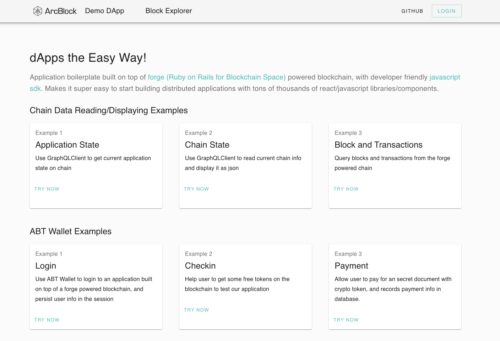
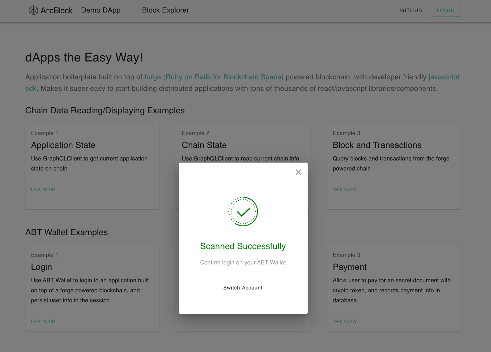

## What problem does the Starter Blocklet solve?

Generally speaking, the formed dApp will be presented in the form of some APP, such as WebApp, NativeApp, etc., and most of the code in these dApps is written using the application development technology stack familiar to developers The basic work of developing a dApp is to integrate the Forge SDK with common application development technology stacks. For example, for developers of React.js, there are many integration solutions:

- with `create-react-app` integrated
- with `next.js` integrated
- with `gatsby.js` integrated
- with `keystone.js + next.js` integrated

::: success
For developers with different development backgrounds, there are many possibilities for integration. Here is just a list of React.js related integration solutions under the framework of JavaScript application development, and other frameworks such as Vue.js can be used.
:::

For most developers, this step is repeated, so we can provide the integrated project as a template for dApp development, and developers can create dApps based on these templates more easily and quickly.

For example, the centralized integration solutions often used in ArcBlock are currently organized into the following Starter Blocklets:

- [forge-react-starter](https://blocklet.arcblock.io/blocklets/starter/forge-react-starter)
- [forge-next-starter](https://blocklet.arcblock.io/blocklets/starter/forge-next-starter)
- [forge-keystone-starter](https://blocklet.arcblock.io/blocklets/starter/forge-keystone-starter)
- [forge-gatsby-starter](https://blocklet.arcblock.io/blocklets/starter/forge-gatsby-starter)

## How do I use the Starter Blocklet?

The usage method is very simple: `forge blocklet:use forge-react-starter` I can create a React application that runs on the Forge application chain and can directly interact with ABT Wallet:

- Support for users [ABT wallet](https://abtwallet.io) log in
- Support users to scan and sign in to collect coins
- Support users to pay test coins to unlock encrypted documents

carried out `forge blocklet:use`, Select `forge-react-starter`, And then specify the directory where the dApp code is stored `demo-dapp`,As shown below:

Next, according to the prompts, configure the necessary parameters for the dApp and complete the configuration. `forge-react-starter` It will automatically create a DID account for the dApp and declare the DID of the dApp on the chain (DID is an identity solution built into Forge):

Key configuration items are for the test chain `GraphQL` Interface, this interface is in `forge start demo-chain` The last column in the output can be found: `http://localhost:8211/api`。

After the dApp is created, there will be a startup prompt as shown below:

Follow the prompts to enter the dApp directory and start the dApp. If everything is normal, you can see the dApp homepage in your browser:

Click "Login" in the upper right corner of the homepage to log in with ABT wallet scanning code. The download address of ABT wallet is at [Here](https://abtwallet.io)。

The entire scan code login process is very similar to the WeChat scan code login:

Enter the user name and email information requested by the dApp on the ABT wallet, confirm by sliding, and after logging in, you will be redirected to the profile page:

Click the "GET 25 DCT" button on the profile page, and then scan the code again to receive 10 tokens on the test chain. Here are 10 instead of 25 because the configuration we checked in is 10. Afterwards, if you refresh the user profile page, you can see that the balance on the chain has become 10.

The function of unlocking and encrypting the payment test coin in the dApp is left to the reader to explore. Tip: Just click the "MY PURCHASE" button on the profile page to open the payment page.
