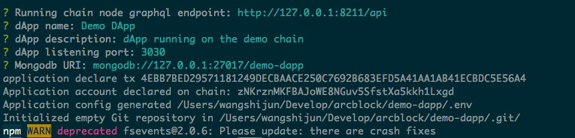
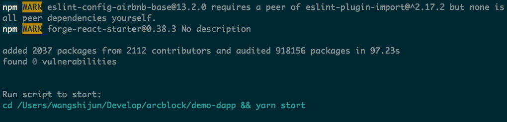
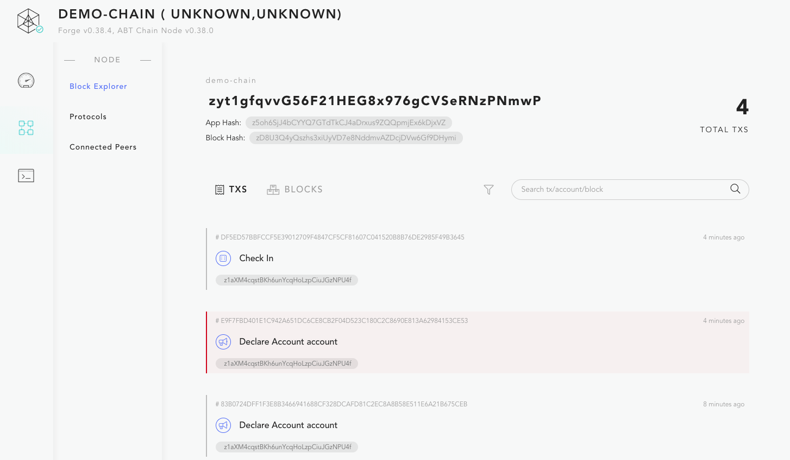

## Starter Blocklet 能解决什么问题？

通常来说，成型的 dApp 都会是以某种 APP 的形式呈现给用，比如 WebApp、NativeApp 等，而这些 dApp 中的大部分代码都是用开发者所熟悉的应用开发技术栈写出来的，这样开发 dApp 的基础工作就是需要把 Forge SDK 和常见的应用开发技术栈集成起来，比如对于 React.js 的开发者来说，可以有很多种集成方案：

- 和 `create-react-app` 集成
- 和 `next.js` 集成
- 和 `gatsby.js` 集成
- 和 `keystone.js + next.js` 集成

::: success
对于不同开发背景的开发者来说，集成的可能性是非常多的，这里只是列举了 JavaScript 应用开发框架下的 React.js 相关的集成方案，还有其他诸如 Vue.js 的框架可以用。
:::

对于大部分开发者来说，这个步骤都是重复的，那么我们可以把集成好的项目作为 dApp 开发的模板提供出来，而开发者基于这些模板去创建 dApp 就变的更方便快捷。

比如目前把 ArcBlock 内部经常使用的集中集成方案整理发布成了如下的几个 Starter Blocklet：

- [forge-react-starter](https://blocklet.arcblock.io/blocklets/starter/forge-react-starter)
- [forge-next-starter](https://blocklet.arcblock.io/blocklets/starter/forge-next-starter)
- [forge-keystone-starter](https://blocklet.arcblock.io/blocklets/starter/forge-keystone-starter)
- [forge-gatsby-starter](https://blocklet.arcblock.io/blocklets/starter/forge-gatsby-starter)

## 如何使用 Starter Blocklet？

使用方法很简单：`forge blocklet:use forge-react-starter` 就能给你创建出来运行在 Forge 应用链，并且能够和 ABT Wallet 直接交互的 React 应用：

- 支持用户用 [ABT 钱包](https://abtwallet.io) 登录
- 支持用户扫码签到领币
- 支持用户支付测试币来解锁加密的文档

执行 `forge blocklet:use`，选择 `forge-react-starter`，然后指定 dApp 代码的存放目录为 `demo-dapp`，如下图：

接下来根据提示，配置好 dApp 所必须的参数，配置完毕，`forge-react-starter` 会自动给 dApp 创建 DID 账户、并且去链上声明 dApp 的 DID（DID 是内置在 Forge 里面的身份解决方案）：

关键配置项是测试链的 `GraphQL` 接口，这个接口在 `forge start demo-chain` 输出里面最后那列能找到：`http://localhost:8211/api`。

dApp 创建结束后会有如下图的启动提示：

按照提示进入 dApp 目录，启动 dApp，如果一切正常，你就能在浏览器里面看到 dApp 的首页：

点击首页右上角的 "Login" 即可使用 ABT 钱包扫码登录，ABT 钱包的下载地址在[这里](https://abtwallet.io)。

整个扫码登录过程和微信扫码登录非常类似：

在 ABT 钱包上输入 dApp 请求的用户名、邮箱信息，滑动确认，完成登录之后，就跳转到档案页面：

点击档案页面的 "GET 25 DCT" 按钮，然后钱包再次扫码，即可领取 10 个测试链上的通证，这里是 10 个而不是 25 个是因为我们签到的配置里面是 10 个，签到完之后，如果刷新用户档案页面，可以看到链上余额已经变成了 10，此时打开测试链的区块浏览器则能看到账户的链上注册和签到操作：

dApp 中的支付测试币解锁加密的功能则留给读者去探索，提示：只需要点击档案页面的 "MY PURCHASE" 按钮即可打开支付页面。
