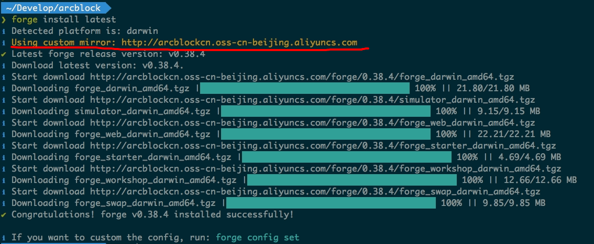

## Global configuration items

You may be wondering carefully: Do you need to manually specify the Taobao npm image specified when installing the Forge CLI, and the Alibaba Cloud image specified when installing Forge? Is there a way to configure it once and use it every time?

The answer is yes. Similar to the widely used command line tools, Forge CLI also supports several global configuration items.

Global configuration items are stored in `~/.forgerc.yml`,you can use `forge config` Command to configure:

Then output the following in it:

```yaml
forge config npmRegistry  https://registry.npm.taobao.org
forge config mirror https://releases.arcblockio.cn
```

In this way, the subsequent execution of Forge CLI commands will read and use these configurations. For example, when you install a certain version of Forge again, the yellow logo as shown below indicates that a custom configuration is used:



apart from `npmRegistry` with `mirror` In addition to the two configuration items, the Forge CLI also supports more other configuration items. [Here](../../9-customization/global-config)。

## Configure chain administrator

For the blockchain, the version of the software used is actually equivalent to the operating system installed on the computer hardware. We all know that if you want to upgrade the operating system version or perform more dangerous operations such as installing executable programs from any source , We need to enter the administrator password to complete. For the blockchain, what operations are restricted operations?

- Upgrade the Forge version used by the chain to the new version
- Deploy a new smart contract on the chain
- Disable existing smart contracts on the chain
- Enable disabled smart contracts

> See the upgrade of the chain for details [Here](../../2-manage-chain-node/upgrade-chain); About what a smart contract is and its basic usage, there will be [Special chapters](../../6-working-with-contracts)Introduction.

Due to the nature of the blockchain's public ledger, any change to the chain needs to reach consensus, that is, to be completed by sending transactions. From a security perspective, these restricted operations cannot be issued by any account, but should be performed by the chain's administrator (Essentially a public-private key pair), the administrator of the chain should specify it in the configuration file when the chain is created, and write it to the initial state of the chain.

It is as simple as creating a Git branch. It is also very low cost to create a chain using the Forge CLI. In the development environment, we can delete the created chain at any time, and then create any number of different chains. If we want to do on the chain, For upgrade or contract related operations, the administrator needs to be configured when the chain is created. The administrator in Forge is called a Moderator, which is meant to be a coordinator.

In order to avoid the tedious manual configuration of the administrator every time a chain is created, the Forge CLI checks the global configuration file in turn when creating a chain `moderatorSecretKey`Environment variables `FORGE_MODERATOR_SK` If it exists, if it exists, the public key and address of the chain administrator are automatically derived from this private key and included in the newly created chain configuration.

::: success
Starting from Forge CLI v1.0.0, when the administrator private key is not found in the environment variables and configuration files when creating the chain, Forge CLI will provide an automatically generated option, and the automatically generated administrator private key will be stored in [Global configuration file](../../9-customization/global-config)in.
:::

In this way, we only need to ensure that the administrator's private key is in the configuration or environment variables. The specific steps are:

- use `forge wallet:create --defaults` To generate a random admin wallet and get the wallet's private key
- In `~/.forgerc.yml` Configuration `moderatorSecretKey`
- Create a new chain and see if the administrator configuration is as expected

The whole process is as follows:

!TerminalPlayer[](./images/3-config-moderator.yml)

Last line `forge chain:create hello -d | grep z1c2CbKL9vFebhRUVoBPhNHtmX8wnY3t4Gk` It is to check whether the Forge CLI automatically includes the newly generated administrator information, because the Forge CLI will print out the configuration of the chain when creating a new chain, and you can see that the configuration includes our newly configured administrator.

::: warning
Actually deriving the administrator's address from the chain administrator's private key is the process of generating the DID, and how exactly the DID is generated is defined in our [DID protocol](https://github.com/ArcBlock/abt-did-spec), Forge SDKs in different languages have implementations of this protocol.
:::
