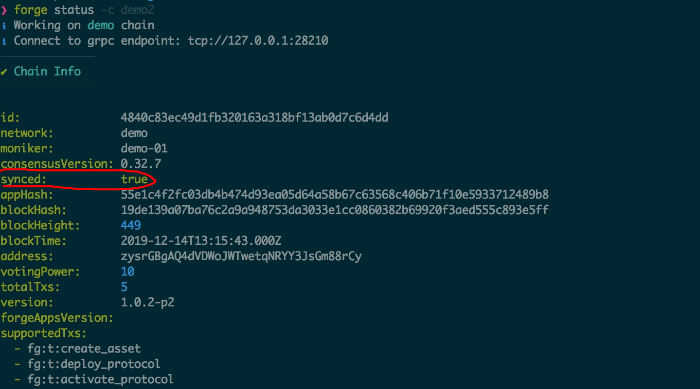
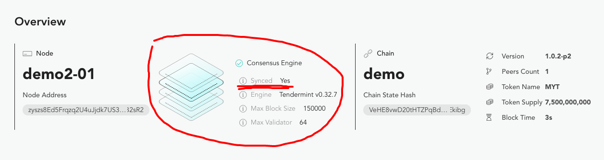

## Why update validators

After the Forge chain is started, because of business needs or changes in participating nodes, it is a common requirement to update the list of validator nodes. The main types of node updates are:

- New nodes need to be added, the more nodes, the more decentralized
- The old node needs to exit, such as the machine running the node expires and the service provider needs to be replaced
- The weight of the existing nodes has been adjusted, so that the voting rights of different nodes can be updated.

## Before you start

::: warning
The function of adding, deleting and updating validator nodes is only supported after Forge v1.0.2-p2 and Forge CLI v1.0.12. If the version of Forge used by your chain is lower, please refer to [Soft upgrade of the chain](../../2-manage-chain-node/upgrade-chain)To upgrade, if your Forge CLI version is earlier, please refer to [How to install Forge CLI](../../1-introduction/install-forge-cli)To upgrade to the latest version.
:::

::: warning
Because the node update is essentially updating the consensus of the chain, the operation itself requires the chain administrator's private key to sign. If you are not sure what the chain administrator is, you can read it first [Initial configuration of the chain](../../1-introduction/initial-setup)。
:::

To make it easier to read, there is a terminology convention in the following documents:

- `网络`: The Forge chain of the validator node needs to be updated. It does not require multiple nodes in the chain. You can add it gradually.
- `节点`: The node that needs to be updated can be a node to be added to the network, a node to be deleted, or a node to be updated

## Add validator node

There are a few more steps to add a validator node, but the Forge CLI can basically help. Here are the specific steps:

### 1. Make sure nodes and network are synchronized

This step requires the nodes to be joined to reach the following states:

- The node is connected to other block-producing nodes in the network, and it is not required to connect all nodes
- The nodes have synchronized the network configuration, historical blocks, and transaction data, that is, to become a verifier node, they must first become [Observer node](../join-existing-network)
- Some nodes in the network can establish P2P connections with the nodes to be joined.

There are at least two different ways to achieve this state:

- To use `forge join <endpoint>` To make the nodes to be joined into the network [Observer node](../join-existing-network), And then wait for the historical block and transaction to complete synchronously
- If you can access the disk data of the existing nodes in the network, copy the data and configuration directly to the machine to be added to the node, and start the node to complete the synchronization.

There are two ways to verify whether a node has reached the synchronization state:

- carried out `forge status`, You can see the node synchronization status, as shown below:
  
- carried out `forge web open` View the synchronous loading directly from the node control panel, as shown below:
  

### 2. Register nodes on the network

Because the verifier node will sign its own proposal during the process of packaging transactions, and other nodes need to verify this signature, this requires the nodes to join to register their public key and address information on the chain publicly, and each node The private key is stored on its own host disk. When the node and the network are synchronized, directly execute the following command on the node to be joined to complete the on-chain registration:

```shell
forge declare:node --validator
```

The output of executing this command is as follows:

```terminal
❯ forge declare:node -c demo3 --validator
ℹ Working on demo3 chain
ℹ Connect to grpc endpoint: tcp://127.0.0.1:28212
⚠ Declare Validator can only be done on the node host machine
ℹ Validator address is zysioYXdQsTHykUgY1wLYKvxQGs3zqiYM3eZ
✔ Validator successfully declared on chain
ℹ Run forge tx 8CCADF7ECC607E9635D8AFD944BE0FF619ADDE6261E9ED59914C1CD63089C8C7 to check transaction
ℹ Run forge account zysioYXdQsTHykUgY1wLYKvxQGs3zqiYM3eZ to check account state
```

::: warning
If you start too many chains locally, you need to execute `forge declare:node -c chainName --validator`
:::

### 3. Add validator node

Then you can add the node to the network's validator list, execute the following command:

```shell
forge chain:validator -c demo --address zysioYXdQsTHykUgY1wLYKvxQGs3zqiYM3eZ --power 10
```

here `address` The parameter is the address of the new node, and `power` The parameter is the voting weight of the new node. The default voting weights of Forge chain nodes are `10`。

## Update validator node

The command to update node weights is very similar:

```shell
forge chain:validator -c demo --address zysioYXdQsTHykUgY1wLYKvxQGs3zqiYM3eZ --power 20
```

## Delete validator node

Set the voting weight of the validator node directly to `0`, You can delete the validator node, the specific command is as follows:

```shell
forge chain:validator -c demo --address zysioYXdQsTHykUgY1wLYKvxQGs3zqiYM3eZ --power 0
```

## Detailed steps

At the same time, in order to make it easier for the reader to understand the whole process, the reader can follow the steps below to**On a single machine**Experiment with node addition:

1.  `forge install latest`, Install the latest Forge version
2.  `npm install -g @arcblock/forge-cli`To install the latest Forge CLI
3.  `forge chain:create demo -d`To create the first node
4.  `forge start demo`, Start the first node, so we have a single-node network, and 1 node in the network is responsible for generating blocks
5.  `forge chain:create demo2 -d`To create the second node
6.  `forge join http://localhost:8210/api --yes`, Add the second node to the network of the first node
7.  `vim ~/.forge_chains/forge_demo/forge_release.toml`, Put `tendermint.persistent_peers` The IP address inside is changed to `127.0.0.1`Or the second node will not be able to connect to the first node
8.  `forge start demo2`, Start the second node, if your operation speed is fast, the second node can quickly reach the synchronization state
9.  `forge declare:node -c demo2 --validator`, Register 2 nodes on the chain, wait for the transaction to complete, get the node address `address`
10. `forge chain:validator -c demo --address <address> --power <power>`, Wait for the transaction to complete, and complete the node addition
11. `forge web open -c demo` Open the block browser of node 1 to see the latest transactions and blocks
12. `forge web open -c demo2` Open the block browser of the second node and view the latest transactions and blocks. If nothing else, the data seen on both sides is the same.
