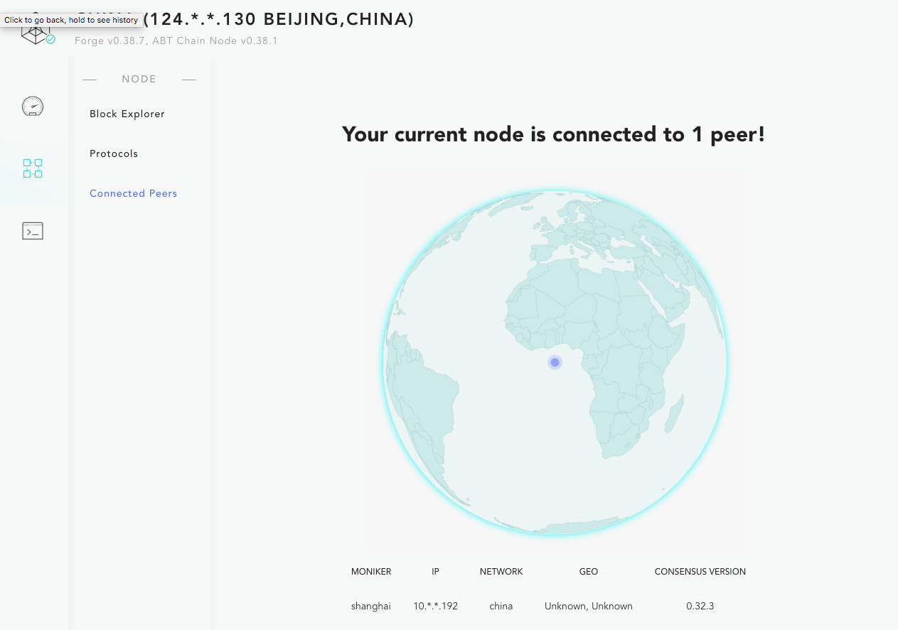
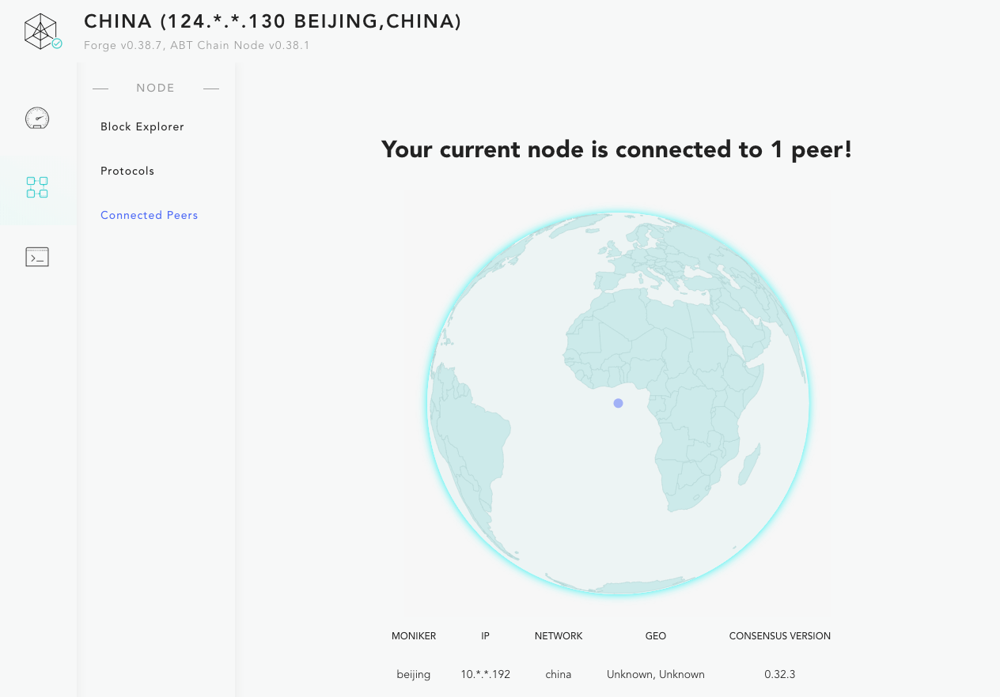

## The basic steps

In [Deploying a multi-node private chain](../deploy-multi-node-network) The nodes of the chain we deploy belong to one party, but the actual situation in the real world is often not the case. Multiple stakeholders come together to start a co-constructed and shared chain, because the private keys of each node may belong to different Participants, so this process requires some manual steps to complete, as described below:

- All node participants have the same version of Forge CLI and the same version of Forge
- All the node participants are ready to run the machine of the node, and the network conditions of the machine need to meet the mutual reachability between the nodes
- The lead node is selected to collect the verifier information of each node (this information does not include the node's private key, which is stored by each node)
- Each node initializes its validator information: `forge deploy:prepare`And send the verifier information to the lead node
- After collecting the validator information of all nodes, assemble a correct configuration file and synchronize it to all participating nodes
- After all participating nodes get the configuration, start their respective nodes: `forge start`Even if the chain is started

## Video tutorial

To help illustrate the whole process, let's assume that we want to start a program named `china` Chain, this chain contains two nodes: `beijing` with `shanghai`The entire configuration process is as follows:

!TerminalPlayer[](./images/multi-party-network.yml)

Node description about this demo process:

- `forge chain:create beijing -d`: Create `beijing` node
- `forge chain:create shanghai -d`: Create `shanghai` node
- `forge deploy:prepare -c beijing --mode init --write-config`: Initialization `beijing` Node, validator information will be written directly into the configuration
- `forge deploy:prepare -c shanghai --mode init`: Initialization `shanghai` Node, verifier information will be printed directly into the terminal
- `forge deploy:prepare -c beijing --mode join`: Update `beijing` Node, put `shanghai` Node link string and validator information are added
- `forge chain:config -c beijing | grep 'config file path'`: turn up `beijing` Node's configuration file path
- Same find `shanghai` Node configuration file path, and put the two `chain_id` change into `china`And this is the name of our chain
- Then put `beijing` In the node configuration file `persistent_peers` with `tendermint.genesis` copy to `shanghai` Node configuration
- `forge start beijing`: start up `beijing` node
- `forge start shanghai`: start up `shanghai` node
- `forge status net -c beijing`: View `beijing` Node network information, you can see `peer` have inside `shanghai` node
- `forge status net -c shanghai`: View `shanghai` Node network information, you can see `peer` have inside `beijing` node

::: error
The synchronization part of the configuration file between multiple nodes in the video tutorial also needs to pay special attention to keeping the following information consistent. If you find any inconsistencies during the actual operation, please do the synchronization yourself:

**In particular, the administrator private keys and initial currency holding accounts of different chain nodes are automatically generated by the Forge CLI.**

- `tendermint.genesis.genesis_time` Ensure that the startup time of all chain nodes is the same
- `forge.transaction` Ensure that all chain nodes have the same configuration for transaction processing, such as transaction size restrictions, and allow peer-to-peer authorized transaction types
- `forge.prime` Configuration of the chain administrator
- `forge.token` Configuration of on-chain tokens
- `forge.accounts` Configuration of the initial holding account list of on-chain tokens

Because the configuration related to the chain is placed in the state of the chain when the chain is first started, if the configuration of the chain is different between different nodes, the alliance chain cannot be started. For more documentation on configuration see [Here](/docs/instruction/configuration)。
:::

::: error
In addition, in order to ensure connectivity between genesis nodes, it is especially necessary to ensure that `persistent_peers` The IP and port number in the node can be accessed by each other, otherwise it will cause the entire case to fail to start.
:::

## Effect verification

Next, if you execute:

```shell
forge web open -c beijing
forge web open -c shanghai
```

And open the ["connected peers" page](http://127.0.0.1:8211/node/status)You can see the following two pictures:





It can be determined that our alliance chain was successfully launched.

Maybe you have noticed that throughout the configuration process, the public information of the node is passed in the chain configuration file, such as link information, address, name, etc., and does not include the private key. During actual deployment, `beijing` with `shanghai` The operation of the nodes should be done by different people. The public information of each node can be safely transmitted on the network. After converging into the configuration file of the entire chain, the chain can be started.

::: warning
Most of the configuration of the chain, except for the port and file storage path, will be written to the chain state. You need to ensure that these configurations are accurate before the chain starts. If you want to modify the chain after startup, you need to stop the chain and reconfigure it to start. .
:::
