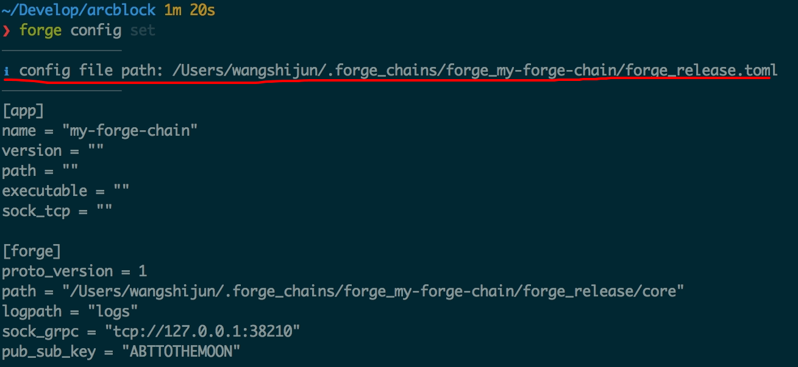
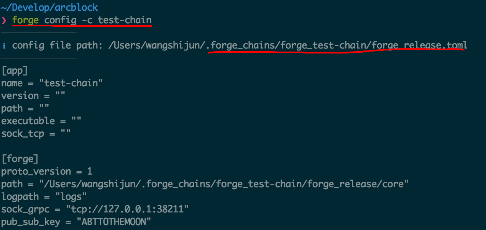

## Initialize chain node configuration

From the perspective of whether configuration items need to reach consensus (that is, maintain consistency) between nodes, we can divide configuration items into two categories:

- Configurations that belong to the entire chain: such as the name of the chain, the verifier information of the chain, the token information on the chain, [Administrator Information](../../1-introduction/initial-setup)This type of configuration can usually not be modified through configuration files after the chain is started, because this will destroy consensus, similar to modifying the block size in the Bitcoin network
- Configurations that belong to a single node: such as the node name, the directory where the node data is stored, and the port that the node's external interface listens on. Such configurations can be modified after the node is started, but most of the time the configuration needs to be restarted to take effect.

Chained [Configuration parameter](https://docs.arcblockio.cn/zh/docs/instruction/configuration)Many of these configuration items can be adjusted through the Forge CLI when they are created.

In [Quick start](../../1-introduction/getting-started) Inside we use `forge chain:create my-forge-chain -d` Created a chain in the default configuration, here's `-d` This means telling the Forge CLI to use the default configuration all.

Remove `-d` Parameter, use the new chain name (Forge CLI does not allow creating chains with the same name), and execute the command again `forge chain:create test-chain`You can configure our chain interactively. as follows:

!TerminalPlayer[](./images/4-create-chain.yml)

Regarding the custom configuration, we explain line by line as follows:

1.  chain name: **test-chain**: The name of the chain is test-chain, so is the name of the node
2.  Please input block time (in seconds): **5**: Block production time is 5 seconds
3.  Do you want to customize token config for this chain? **Yes**: Select a coin on a custom chain
4.  What's the token name? **Test Chain Token**: The name of the coin
5.  What's the token symbol? **TCT**: Currency symbol, at least 3 characters
6.  What's the token icon? **/Users/wangshijun/.forge_cli/tmp/token.png**: The path to the coin's icon file, a square PNG image is recommended
7.  Whats the token description? **Token on test chain**: Description of coin
8.  Please input token total supply: **1000000000**: The total supply of coins is 1 billion
9.  Please input token initial supply: **1000000000**: The initial supply of coins is 1 billion
10. Please input token decimal: **18**: Coin precision is 18 digits after the decimal point
11. Do you want to enable "feel lucky" (poke) feature for this chain? **Yes**: Allow users to sign in to collect coins
12. Do you want to customize "feel lucky" (poke) config for this chain? **Yes**: Need to customize the parameters
13. How much token to give on a successful poke? **10**: 10 coins per sign-in
14. How much token can be poked daily? **100000**: Release up to 10,000 per day
15. How much token can be poked in total? **146000000**: The maximum number of coins allowed to be signed in to receive coins
16. Do you want to include moderator config in the config? **Yes**: Automatically include chain administrator information
17. Set moderator as token owner of (854000000 TCT) on chain start? **Yes**: Put the remaining coins in the account of the chain administrator, you can use the program to transfer them

Additional notes on these issues:

- For the 17th question, you can choose No. In this way, we need to set up a coin holder for the creation of the world, because the initial circulation of coins is 1 billion, and the maximum number of signed coins is 146 million, leaving 854 million. Only deposit it in an account where you have the private key, otherwise this coin is equivalent to being permanently locked in the network and cannot be circulated.

## View chain node configuration

Where is the configuration of the newly created chain stored? What does the content look like? Direct execution `forge chain:config` You can print the path and content of the configuration file to the terminal, as shown in the screenshot below:



Attentive students may see that implementation `forge chain:config` When the configuration file is printed `my-forge-chain` Configuration file instead of the one we just created `test-chain`。

So how to check `test-chain` What about the configuration? Forge CLI supports multi-chain by default (detailed document reference [Here](../../9-customization/multi-chain)), You can execute `forge chain:config -c test-chain` Come view `test-chain` Configuration, as shown in the figure:



::: warning
Please refer to Forge CLI multi-chain support function details and detailed syntax [Here](../../9-customization/multi-chain)。
:::

## Modify the chain node configuration

Since the configuration of the chain can be customized at creation time, what happens after it is created? It is also possible to execute directly `forge chain:config set` Meeting `forge chain:create` Similar interactive interface, the difference is that this time it is not a brand new parameter configuration, but a modification based on the old configuration. It should be noted that modifying the configuration of a chain requires stopping the node and the configuration of the chain level Once started, the modification will not take effect.

For example, if we want to modify `test-chain` The currency symbol is `TTC`,carried out `forge chain:config set -c test-chain`The process is as follows:

!TerminalPlayer[](./images/5-config-set.yml)

After modification, you can use the following command to verify:

```shell
❯ forge chain:config -c test-chain | grep TTC
  symbol = "TTC"
```

## Comprehensive understanding of chain node configuration

The chain node configuration supported by the Forge CLI is only the most critical part of the configuration items supported by Forge. For a complete list of configuration items, you can punch [Here](https://docs.arcblockio.cn/zh/docs/instruction/configuration)
