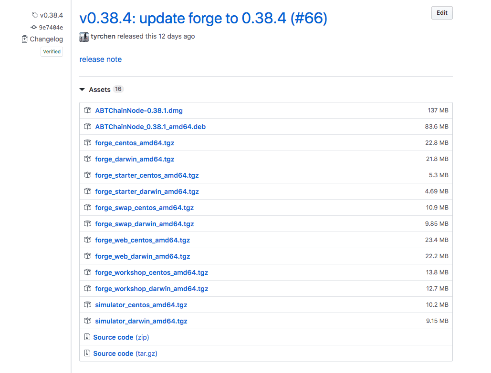

The Forge distribution can be thought of as a container containing the Forge kernel and various tools developed around it.

With the iteration of products and technologies, the Forge distribution contains only the Forge kernel from the beginning, and now includes the following components:

- Forge Kernel: Transaction processing engine, interaction with consensus engine and data storage layer, large and small versions will be released every week
- Core smart contracts: Forge's built-in transaction contracts can help developers solve 99% of their business logic such as accounts, transactions, cross-chain, on-chain governance, etc.
- Forge Desktop: Desktop version of the chain node, with Forge synchronized release
- Forge Web: Web management interface and block browser of the Forge chain node, how to use it [Here](../8-explorer-other-tooling/forge-web), Released synchronously with the Forge kernel
- Forge SDK: SDKs for various languages. Currently supported languages include Elixir, Javascript, Java, Python, Rust. Except for the simultaneous release of Elixir and Forge, SDKs for other languages use follow-up releases.
- Forge Simulator: traffic simulator, how to use [Here](../8-explorer-other-tooling/simulator)
- dApp Workshop: dApp prototype workshop, released with Forge
- Forge Patron: Integrated testing tool, not yet publicly released
- Forge Deploy: Ansible is used internally for large-scale deployment tools in production environments. Currently, only private chain deployment is supported. [ArcBlock/forge-deploy-public](https://github.com/ArcBlock/forge-deploy-public) Get the source code
- Forge Compiler: a smart contract compilation tool, released with Forge, available in the Forge CLI. For details, see [Here](../6-working-with-contracts)

One of our Forge distributions on GitHub looks like this:

Here are some important facts about the Forge release:

- Forge releases currently only support Linux systems such as MacOS, CentOS, Ubuntu, and not Windows.
- The Forge distribution includes only the executable files or compiled code of each tool, not the source code.
- Forge releases are stored at [releases.arcblock.io](http://releases.arcblock.io/forge) Download for developers
- The latest version of the Forge release can be downloaded from [latest.json](http://releases.arcblock.io/forge/latest.json) Found
- The complete history of Forge releases can be found from [versions.json](http://releases.arcblock.io/forge/versions.json) Found
- Some Forge toolbox components are not included in the Forge distribution, such as Forge Deploy, Forge Patron
- To ensure the download speed of developers in mainland China, we mirrored the distribution on Alibaba Cloud [releases.arcblockio.cn](https://releases.arcblockio.cn/forge/latest.json)

::: success
**The Forge CLI is only a bridge for developers to obtain the Forge release and use the components included in the release. `Forge` Let's call the release version of Forge, lowercase. `forge` Refers to the command-line tool generated on the system after installing the Forge CLI.**
:::
