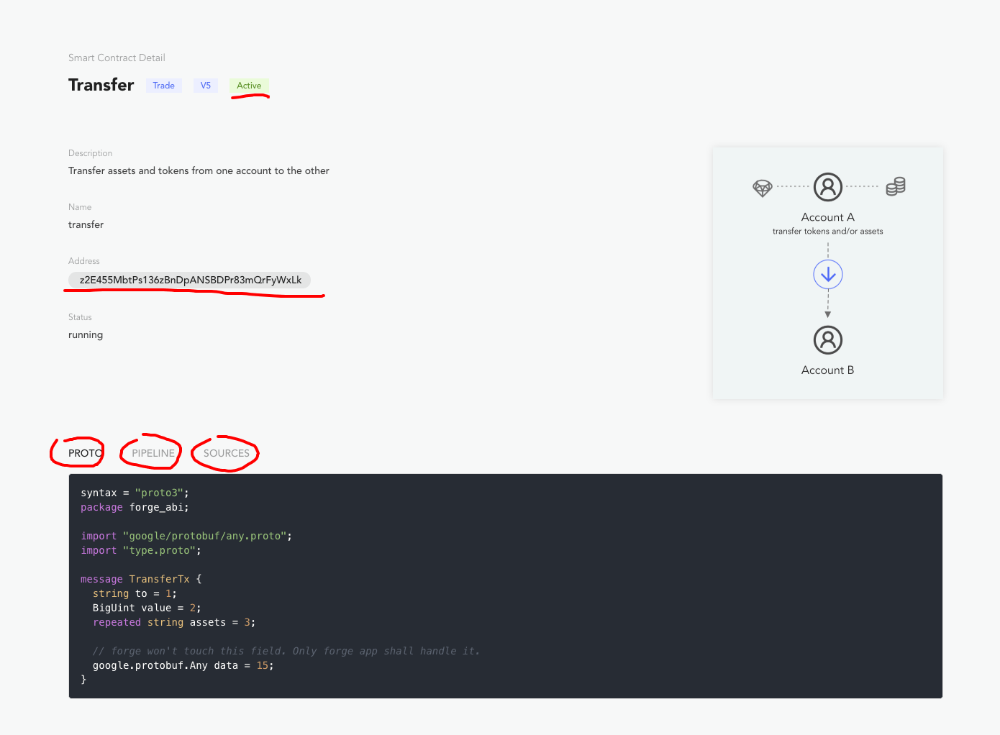

Forge 中的合约是定义了某种业务场景下链状态变更流程的代码集合，主要包括：

- 交易的处理流程
- 交易的验证逻辑
- 交易执行后链状态更新的逻辑
- 交易会使用的数据结构

链启动之后，可以通过 `http://localhost:8210/node/contracts` 查看所有链上安装的合约，比如下面是转账合约的详情页面：

这里不难看到关于合约的几个关键信息：

- 合约的状态，是启动中还是被禁用
- 合约的地址，就像账户一样，合约也有自己的 DID
- 合约的源代码，下面几个标签页内容
