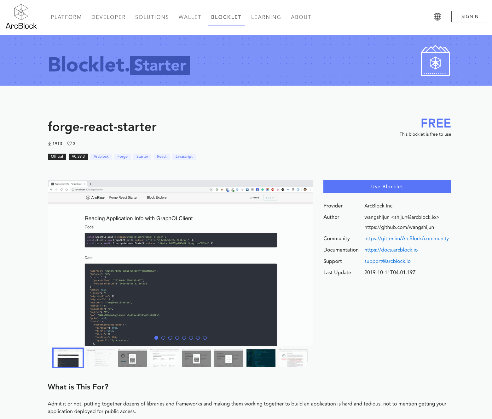

## create

To use `forge blocklet:init` The command can initialize a Blocklet project. During the initialization process, several variables need to be set:

```shell
$ forge blocklet:init
This utility will walk you through create such files and folders(if not exists):
- blocklet.json
- blocklet.md
- package.json
- screenshots/
- <templates folder>/(upon your input)

It only covers common items, if you want to check all items, please visit:
https://github.com/ArcBlock/blocklets#keyinfo-blockletjson

Press ^C to quit.
? blocklet name: blocklet-demo
? Please write concise description: This is a blocklet demo
? What's group of the blocklet? starter
? Choose a color for your blocklet: primary
? Blocklet templates folder name: templates
```

- name: Blocklet name
- description: Blocklet description
- group: classification of blocklet, currently optional `dApp | starter | contract`
- color: Select the color theme of the blocklet. `primary | secondary | error`
- templates: specify the template code directory, if there are multiple, use a comma ( `,`)Split

::: success
Here are just some of the commonly used settings. For more detailed settings, see [Here](https://github.com/ArcBlock/blocklets#keyinfo-blockletjson)。
:::

After the command is successfully executed, the following files and directories are generated:

```shell
├── blocklet.json
├── blocklet.md
├── package.json
├── screenshots/
└── templates/
```

::: success
Of course, if you don't want to be so troublesome, you can use forge blocklet: init -y | -d to complete the initialization with default parameters.
:::

### What are these files (directories) useful for?

#### blocklet.json

This file is the core file of the blocklet, and the analysis of the blocklet is based on this file.
This file provides the blocklet's `名字`， `类型`， `作者`And other meta-information, as well as the scripts needed to create an application based on the blocklet (see below for details) `在 blocklet.json 中设置执行脚本`one period).

#### blocklet.md

This file will be displayed as the Blocklet detail page of the official website by default, so it is recommended to include the following in the document:

- What is this Blocklet?
- What features are provided?
- example
- External dependencies using the blocklet

#### package.json

Because Blocklets are now packaged via npm, this file is required.

In addition, for `blocklet.json` with `package.json` All supported fields if `blocklet.json` No settings in the official website or CLI will be used when parsing `package.json` Fields, such as description information and so on.

#### screenshots/

This directory is some screenshots of the dApp generated by the Blocklet, which will be displayed on the Blocklet details page on the official website, so that other developers can easily see what features are available.

Details page shows screenshot example:


#### Template directory

This directory is the source code needed to use this Blocklet to generate dApps. The directory where the code is stored in the example is `templates`。

Of course, this can also be an array.

### Set execution script in blocklet.json

A dApp created through a blocklet may require the support of a chain or a database at runtime. How can a dApp set these configurations?

Available through the CLI `钩子脚本` to realise. The CLI divides these scripts into two parts: the scripts that the blocklet itself needs to execute, and the scripts that the generated dApp needs. These two configuration items are in `blocklet.json` Medium `install-scripts` with `hooks` Two nodes are set.

#### Set install-scripts

::: warning
The execution of scripts in the install-scripts node is performed in the order defined.
:::

The execution timing of the script for this node is `复制`Before template code, before `hooks`Execute; so,**If the Blocklet itself has dependencies that need to be installed, you can put it here.**

#### Setting up hooks

The following four phases are currently supported in hooks

1.  pre-copy
2.  post-copy
3.  configure
4.  on-complete

::: warning
The scripts in hooks are executed in the order of pre-copy-> post-copy-> configure-> on-complete.
:::

##### pre-copy

This stage is at `复制模板代码前`Executed, so if you want to do some preparation before copying the code, you can do it by defining a script here.

##### post-copy

This stage is at `复制模板代码后`Executed, so if you want to do something after copying the code, such as installing dependencies, initializing the git repository, etc.

##### configure

This phase is the key phase of creating a project based on blocklets. It is recommended that configuration item scripts required by the project be executed in this phase.
For example, for a dAPP, you need an available chain, and possibly database support, so you can put the chain and database settings at this stage.

##### on-complete

This is the last stage. After completing the previous steps, you can now start the project if it is successful, so you can put the command to start this project here, for example:

```shell
Run script to start:
0. cd blocklet-demo
1. make run-server
2. yarn start
```

In this way, developers can easily start this project.

`blocklet.json` example:

```shell
{
  "name": "blocklet-demo",
  "group": "dApp",
  "color": "primary",
  "templates": "templates",
  "description": "",
  "keywords": [],
  "install-scripts": {
    "install-dependencies": "echo 'no dependencies scripts'"
  },
  "hooks": {
    "pre-copy": "echo 'no configure hooks'",
    "configure": "echo 'no configure hooks'",
    "post-copy": "echo 'no post-copy hooks'",
    "on-complete": "echo 'no on-complete hooks'"
  }
}
```

## test

can use `CLI` Medium `forge blocklet:use --local-blocklet <blocklet directory>` Directive to test a local Blocklet project:

```shell
$ forge blocklet:use --local-blocklet /Users/zhenqiang/workcode/forge-python-starter
✔ Fetching blocklets information...
yarn install v1.17.3
[1/4] 🔍  Resolving packages...
success Already up-to-date.
✨  Done in 0.24s.
? Running chain node graphql endpoint: (http://localhost:8210/api)
...
```

Pass `--local-blocklet` Parameter to specify a local blocklet project to test the project you just created.

## release

How to publish the Blocklet project to our after completing development and testing [Official website](https://blocklet.arcblock.io/blocklets/)How about it?

Currently, all our blocklets must be published in `NPM` On, at the same time, you must also**Published to NPM** Add the Blocklet on our official warehouse, the specific process is as follows:

Now we can only support**Manual review**Way, you need to publish by submitting PR.

0.  Publish the project to NPM
1.  Fork this project <https://github.com/ArcBlock/blocklets>
1.  And then modify the `register.yml`, Put your own Github project address:

```yml
---
- repo: https://github.com/ArcBlock/forge-dapp-starters
- repo: https://github.com/wangshijun/forge-product-factory-contract
- repo: https://github.com/ArcBlock/forge-python-starter
- repo: https://github.com/blocklet-demo
```

3.  Then submit a PR.
4.  After passing the manual review, we will merge this PR into the master branch. After the build is complete, you can see your Blocklet project on the official website.
