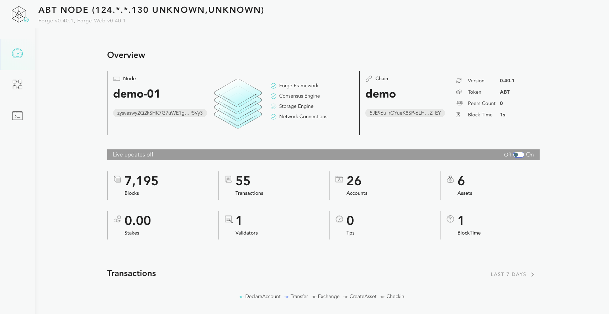
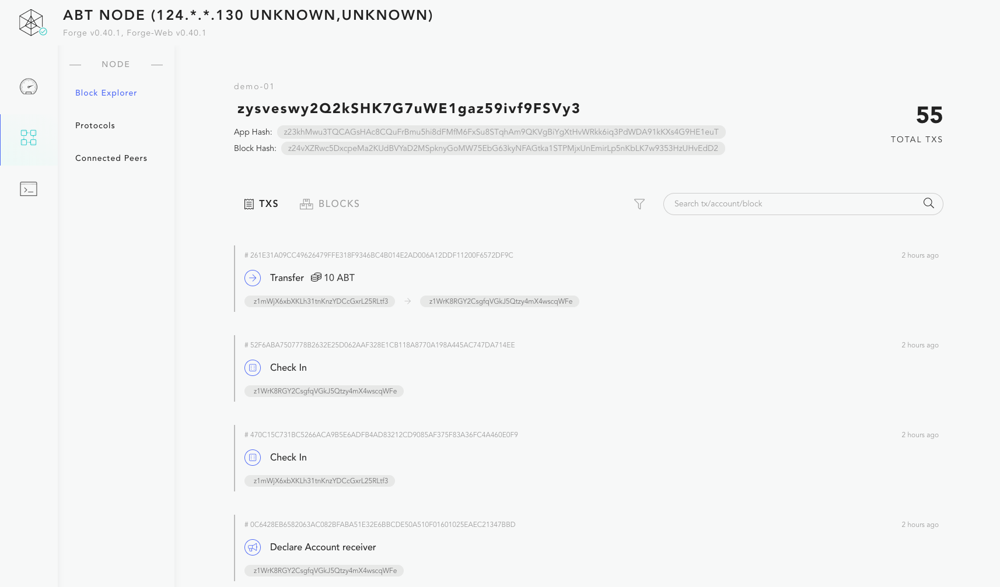
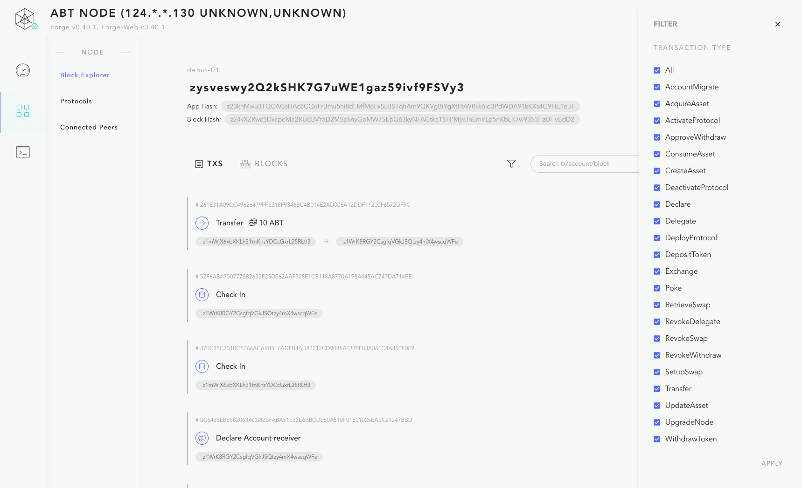
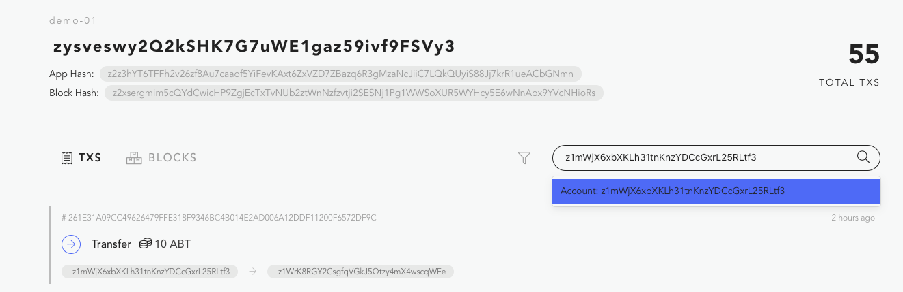
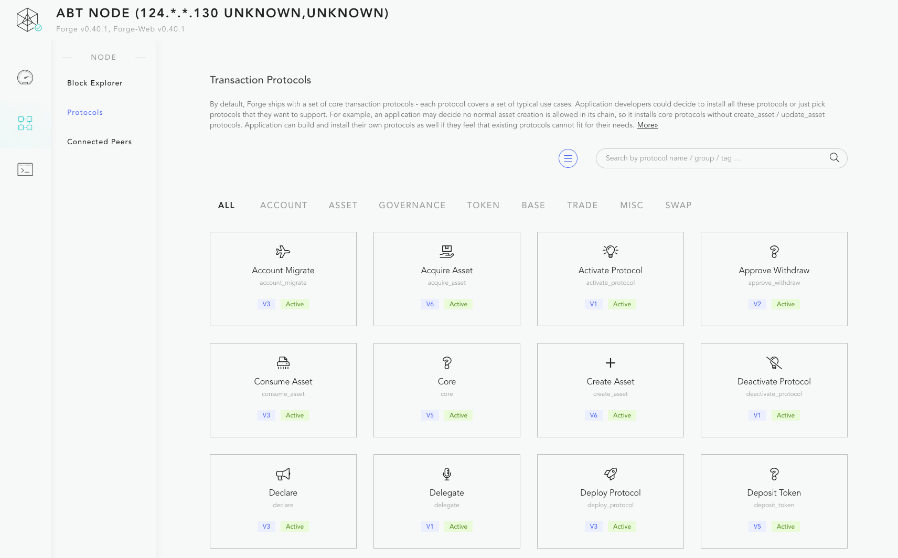
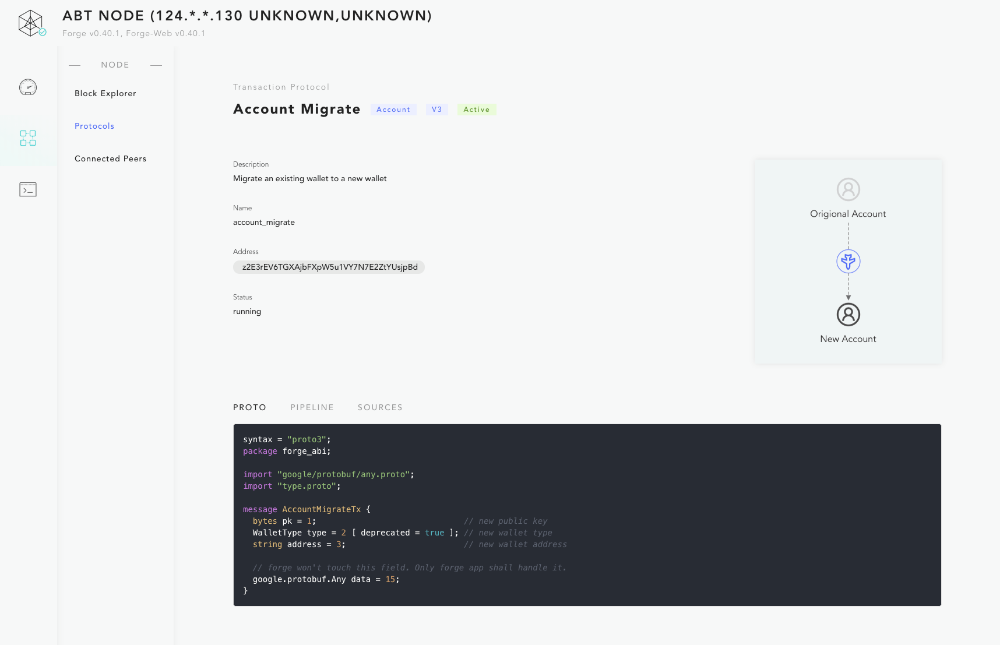
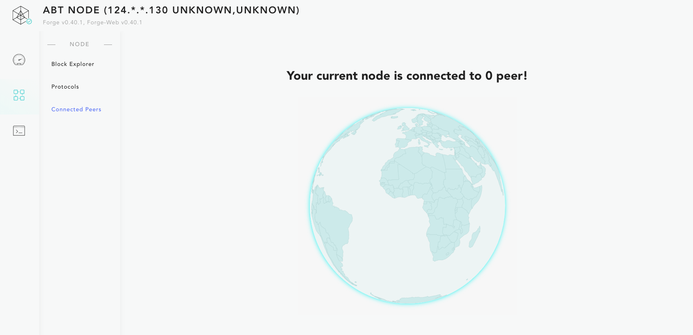
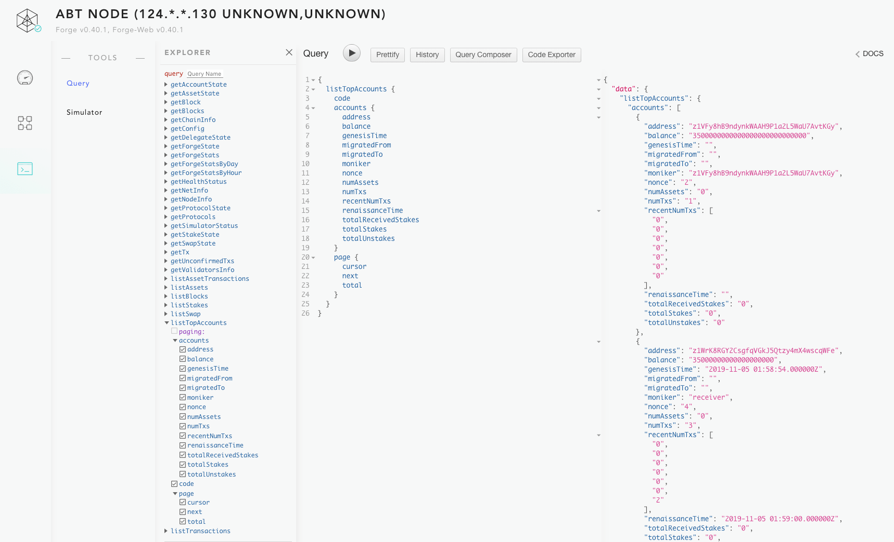
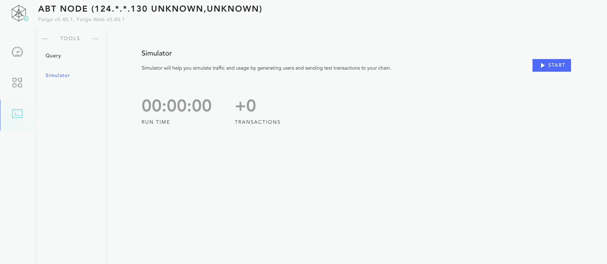

Forge 内置了一个可视化的浏览链节点状态的 WEB 应用，该应用中包含了多个功能模块，打开方式为 `forge web open`。

::: warning
如果你创建了多条链，某条链的 WEB 界面的启动方式为 `forge web open -c chainName`，默认情况下 Forge CLI 在启动链节点的时候该应用其实已经启动了。如果你是在无视窗的操作系统中使用 Forge CLI，`forge web open` 是不能工作的。
:::

## 链节点仪表盘

节点仪表盘里面简要的展示了链、节点的基本信息，以及链的几个关键指标。具体包括：

- 链的名称、币的名称、节点的名称
- 链上的账户数、区块数量、交易数量、资产数量等

此外，仪表盘还支持实时更新模式，点击 "Live Updates" 那个灰色的条，就可以自动刷新链的关键指标。

## 区块浏览器

区块浏览器里面支持用户方便的浏览链上的数据，分为列表页和详情页两大类页面：

### 列表页

- 交易列表，按时间倒序排列
- 区块列表，按时间倒序排列，自动过滤掉了空块

### 详情页

- 交易详情页，能看到交易的详情，以及原始数据
- 区块详情页，能看到区块内的全部交易
- 账户详情页，能看到账户余额、所拥有的资产、所发生过的交易
- 资产详情页，能看到资产所有者、创建者、发生过的历史交易
- 跨链详情页，可以看到 SwapState 的详细信息，比如谁和谁交换，交换了什么，目前是否换成
- 授权详情页，可以看到 DelegationState 的详细信息，比如授权给谁，可以做什么，规则是什么

### 过滤功能

交易列表页支持按交易类型来过滤，如下图右边所示。

### 搜索功能

区块浏览器里面最强大的搜索框，支持按下面几种关键字去搜索：

- 交易的 Hash
- 区块的高度
- 账户的 DID
- 资产的 DID
- Swap 的 DID
- Delegation 的 DID

## 合约浏览器

可扩展的合约是 Forge 设计里面很重要的部分，把链节点上安装的合约全部列出来也非常有必要，如下：

### 合约详情

点击每个合约的方块，可以打开合约的详情页，可以看到合约的历史版本、合约的源代码，以及合约的简单示意图。

## 链接节点列表

怎么查看链节点跟哪些节点完成了 P2P 链接？

## 查询构造器

这是个非常强大的查询构造工具，构造在 Forge 提供的 GraphQL 查询接口之上，通过界面左侧简单的鼠标点击就可以构造出复杂的数据查询语句，执行查询就能拿到结果。

## 流量模拟器

流量模拟器可以在 WEB 界面去打开或者停止，也可以通过 Forge CLI 去启动或者停止，详见[这里](../simulator)。

